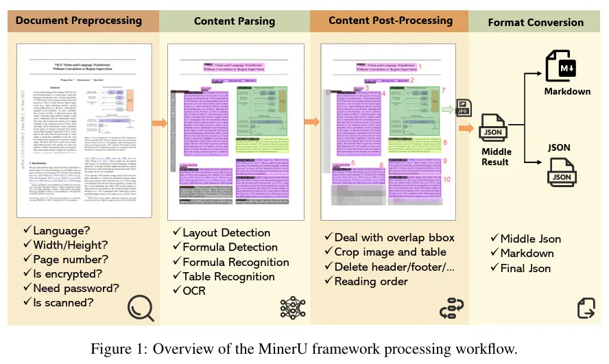
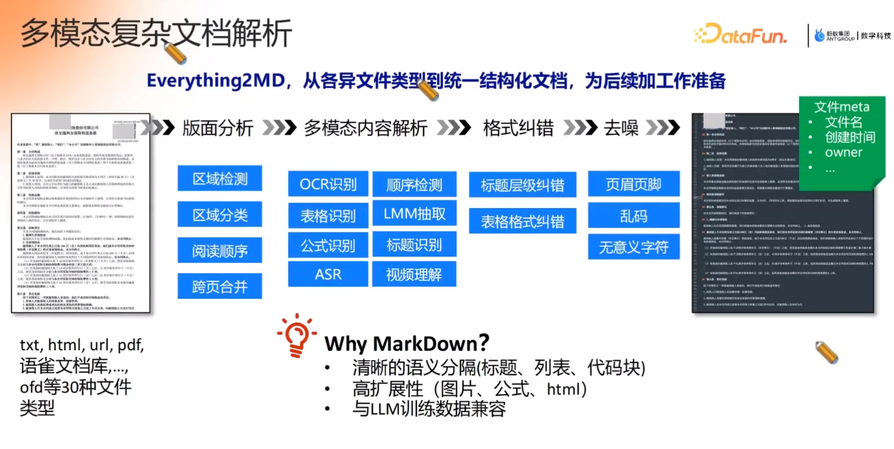

# 论文  
+ 论文地址  
  [MinerU: An Open-Source Solution for Precise Document Content Extraction](https://arxiv.org/pdf/2409.18839) 

+ 开源地址  
  https://github.com/opendatalab/MinerU  git   

+  online demo  
  https://www.modelscope.cn/studios/OpenDataLab/MinerU  

# Overview

# 复杂文档解析 [10]

【everything2Markdown】   
【边界的地方错的多 】   
【去噪 - 页眉 页脚】   

# 参考
[深入拆解 MinerU 解析处理流程](https://mp.weixin.qq.com/s/aV43l8VdGuJ_NxQ1qz_GVg)

10. 蚂蚁数科AI Agent 知识工程实践

# 其他
+ 关于目前文档转换的一些误区认识，讨论见社区。  
  - 目前说的mineru，ocr用的paddlepaddle，table用的rapd-table，版式分析用的doclayout，公式用的unimernet，阅读顺序用的xycut/ layoutreader，公式检测用的yolo，然后串起来，写了很多postprocess，这就是miner-u，纯开源集成；  
    
    而不是里面说的什么多模态，多模态解析能力，支持多种格式的转换及高精度 OCR，不要信，其难的的是后处理的逻辑。  
    
    ocr用来总去，用的还是PaddleOCR。olmOCR，vary，gotOCR2.0这些，都是基于多模态模型微调的方案，没有本质区别。  