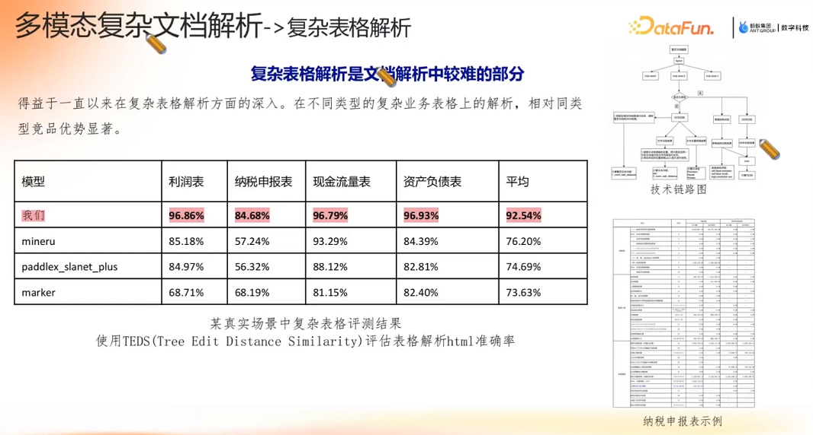
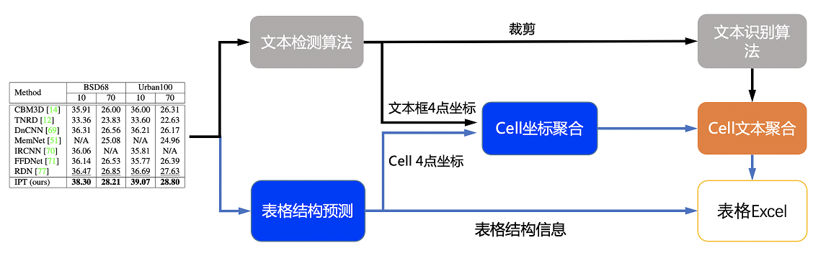

# 表格处理[1]


+ 长表格 处理  
  分成两半各自处理  
  事后做检测，根据页眉页脚做合并， 对边界的处理  


# RapidTable [2]
+ MinerU 中的表格识别使用了RapidTable
+ RapidTable 使用了以下4中模型

``` python
class ModelType(Enum):
    PPSTRUCTURE_EN = "ppstructure_en"   # PaddleOCR
    PPSTRUCTURE_ZH = "ppstructure_zh"   # PaddleOCR
    SLANETPLUS = "slanet_plus"          # PaddleX
    UNITABLE = "unitable"
```

### ppstructure(PaddleOCR)[3]

+ 表格识别主要包含三个模型
  - 单行文本检测-DB
  - 单行文本识别-CRNN
  - 表格结构和cell坐标预测-SLANet

具体流程图如下  



# 参考

1. 蚂蚁数科AI Agent知识工程实践  Datafun
2. https://github.com/RapidAI/RapidTable  
   https://github.com/opendatalab/MinerU  
3. [ppstructure/table](https://github.com/PaddlePaddle/PaddleOCR/blob/133d67f27dc8a241d6b2e30a9f047a0fb75bebbe/ppstructure/table/README_ch.md)  

1xx. [RAG实战系列，如何针对word文档中的表格进行问答，解决跨页表格问题](https://www.bilibili.com/video/BV1Cf1aYQE1s/) v  
1xx. [将图片或PDF中复杂的表格数据转成纯文本输入大模型，如何保持表格文字的排版布局不变？](https://www.bilibili.com/video/BV1hJvQeyEZS/) v  