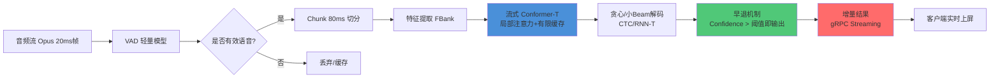

# ASR 端到端延迟优化方案

> **对标**：云知声流式 ASR 实践 | **适用场景**：实时对话 / 会议转写 / 智能客服

---

## 一、延迟瓶颈拆解

典型 ASR 流水线：

```
音频采集 → VAD → 前端特征提取 → 声学模型推理 → 解码器(CTC/Transducer) → 语言模型 → NLU → 响应
```

各环节典型延迟占比（语音转写场景）：

| 环节 | 延迟占比 | 优化优先级 |
|------|---------|-----------|
| 声学模型推理 | 30-40% | ⭐⭐⭐⭐⭐ |
| 解码器搜索 | 20-25% | ⭐⭐⭐⭐⭐ |
| 网络传输 & 调度 | 10-20% | ⭐⭐⭐⭐ |
| 音频采集 & 分帧 | 10-15% | ⭐⭐⭐ |
| 语言模型 / LM | 10-15% | ⭐⭐⭐⭐ |
| VAD 判断 | 5-10% | ⭐⭐ |

---

## 二、核心优化策略

### 2.1 流式架构 + Chunk-Level 推理

**最关键的一步**：把非流式转流式。

- **Chunk 切分**：按 80ms-160ms 切分音频帧，而非等完整音频再处理
- **增量输出**：每处理一个 chunk 就输出部分结果，用户感知延迟从「等整句」降到「实时出字」
- **典型方案**：
  - **Chunk-level Conformer / Branchformer**：局部注意力窗口限制在 chunk 内，全局上下文用有限缓存
  - **Streaming Transducer**：RNN-T / Conformer-T 天然支持流式，延迟低于 CTC
  - **Blockwise / Windowed Attention**：限制注意力范围，推理复杂度从 O(N²) 降到 O(N·W)

**效果**：端到端延迟从 2-3s 降到 200-400ms

### 2.2 声学模型推理优化

| 策略 | 方法 | 效果 |
|------|------|------|
| **模型蒸馏** | Teacher(Conformer-large) → Student(Conformer-tiny) | 推理快 3-5x，精度损失 1-2% CER |
| **量化** | FP16 / INT8 量化（TensorRT / ONNX Runtime） | 推理快 2-3x，GPU 显存减半 |
| **TensorRT 推理加速** | Kernel 融合 + 算子调优 | 推理快 1.5-2x |
| **早退机制（Early Exit）** | 声学模型 confidence 足够时提前输出 | 简单句延迟降 30-50% |

### 2.3 解码器优化

解码器是延迟大头，优化手段最多：

- **CTC Prefix Beam Search**：比 Full Beam Search 快，用 prefix pruning 减少搜索空间
- **RNN-T 贪心解码**：对延迟敏感场景，greedy beam size=1 即可，精度损失可接受
- **Modified Batch Decoding (MBD)**：并发解码多个 chunk，而非串行
- **FastEmit / Contextualized RNN-T**：降低发射延迟（emission delay），让模型更早输出 token
- **LM 融合**：用 shallow fusion 替代 full LM 推理，LM 只在 beam 候选上打分

### 2.4 VAD 与端点检测

- **低延迟 VAD**：用 Silero VAD 或轻量级模型，按 32ms 帧判断，而非 256ms
- **预测性端点检测**：不等说话人完全停顿，基于语义完整性（如句号/问号/感叹号）提前截断
- **双通道策略**：一个快速 VAD 做实时截断 + 一个精确 VAD 做最终校正

### 2.5 网络与系统层优化

| 层 | 优化手段 |
|---|---------|
| **协议** | gRPC streaming / WebSocket 替代 HTTP 轮询 |
| **音频传输** | Opus 编码（低延迟 20ms 帧）替代 PCM 原始传输 |
| **连接复用** | 长连接 + 连接池，避免 TLS 握手延迟（~50-200ms） |
| **边缘部署** | ASR 模型部署到离用户最近的边缘节点，RTT 从 50ms 降到 5ms |
| **批处理调度** | 动态 batching（TensorRT ISM / Triton），吞吐量提升 3-5x 但不增加单次延迟 |

---

## 三、流式 ASR 架构参考



**图表说明**：从音频采集到实时上屏的完整流式链路。核心优化点在流式模型（Conformer-T）、早退机制和增量输出。

---

## 四、典型延迟指标

| 场景 | 优化前 | 优化后 | 主要手段 |
|------|--------|--------|---------|
| 离线转写（整句） | 2-3s | - | 基准 |
| 流式转写 | 800ms-1.5s | 200-400ms | Chunk + RNN-T + 贪心解码 |
| 实时对话 ASR | 500ms-1s | **80-150ms** | 早退 + 边缘部署 + Opus |
| 端侧 ASR（手机） | 300-500ms | 100-200ms | INT8 量化 + NPU |

---

## 五、快准狠三原则

参考云知声 ASR 实践：

- **快**：首帧输出 < 200ms（VAD + Chunk + 流式模型）
- **准**：CER < 5%（流式模型需比离线模型额外优化）
- **狠**：资源利用率（动态 batching + TensorRT）

### 混合策略

先用流式模型实时出字 + 后台用离线模型做一次修正：
1. 用户说话时，流式模型实时上屏（< 200ms 延迟）
2. 用户说完后，后台离线模型用更大 beam size 和 LM 重新解码
3. 几秒后将更准确的离线结果替换流式结果
4. 用户既感受到低延迟，又获得高准确率

---

## 六、不同场景优化侧重

| 场景 | 首要目标 | 核心优化手段 |
|------|---------|-------------|
| **实时对话** | 延迟 < 150ms | 早退 + Opus + 边缘部署 + 贪心解码 |
| **会议转写** | 准确率 > 95% | Chunk + RNN-T + 离线修正 |
| **智能客服** | 延迟 < 300ms + NLU 联动 | 流式 ASR + 并行 NLU 推断 |
| **端侧离线** | 功耗 + 延迟 < 200ms | INT8 量化 + NPU + 小模型 |

---

## 附：关键参考

- **Conformer**: Gulati et al., "Conformer: Convolution-augmented Transformer for Speech Recognition", Interspeech 2020
- **RNN-T**: Graves, "Sequence Transduction with Recurrent Neural Networks", ICML 2012 Workshop
- **Streaming Transducer**: Zhang et al., "Streaming End-to-End Speech Recognition With Transducers", Interspeech 2020
- **FastEmit**: Yu et al., "FastEmit: Low-latency Streaming ASR with Sequence-level Emission Delay", ICASSP 2021
- **Silero VAD**: https://github.com/snakers4/silero-vad
- **TensorRT**: https://docs.nvidia.com/deeplearning/tensorrt/
