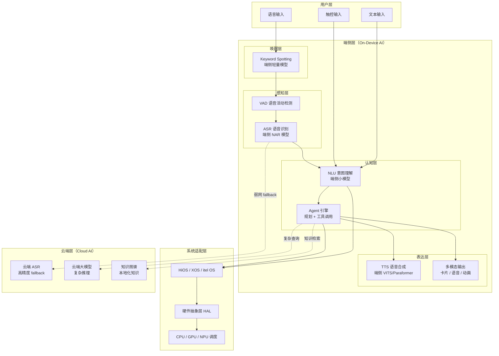
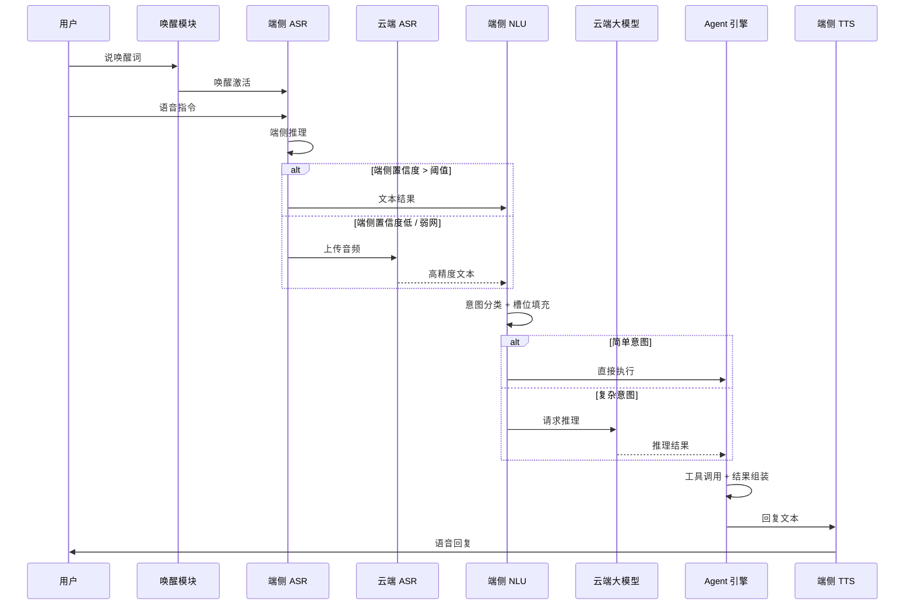
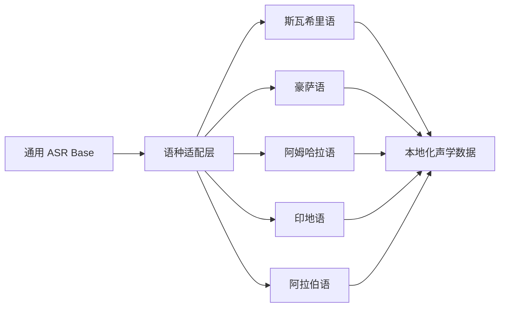
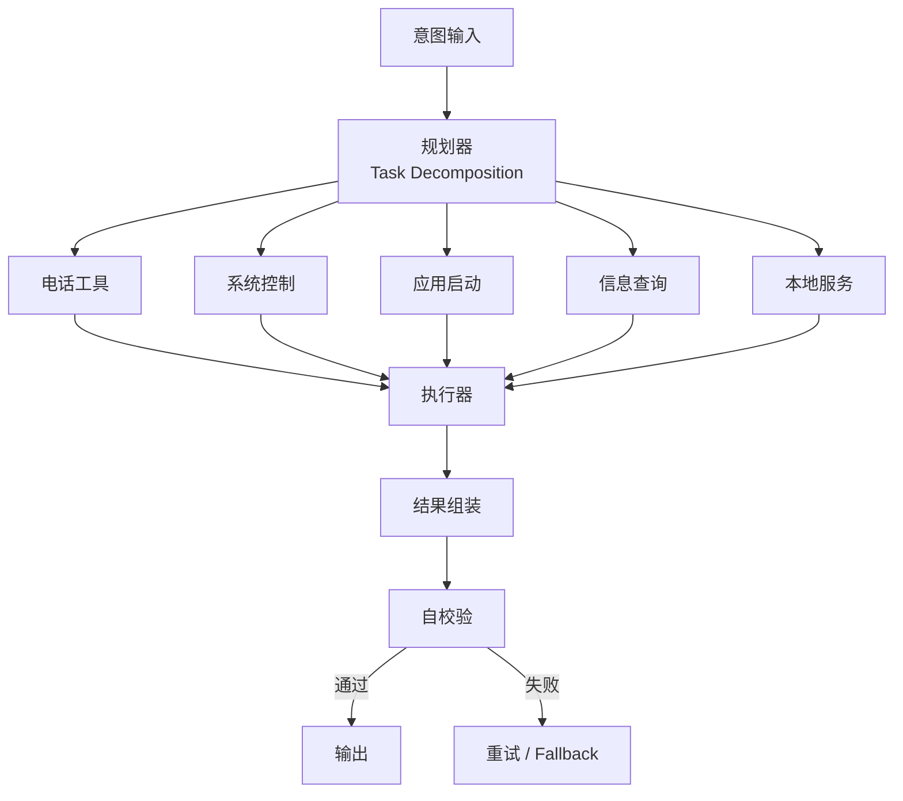
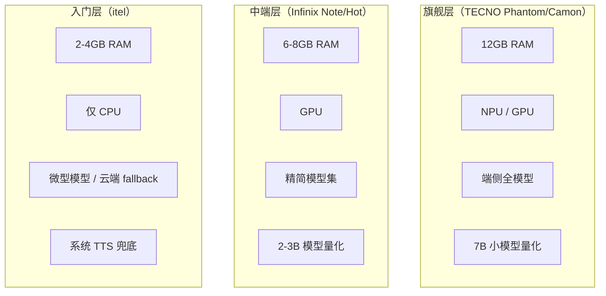
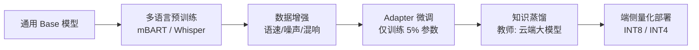
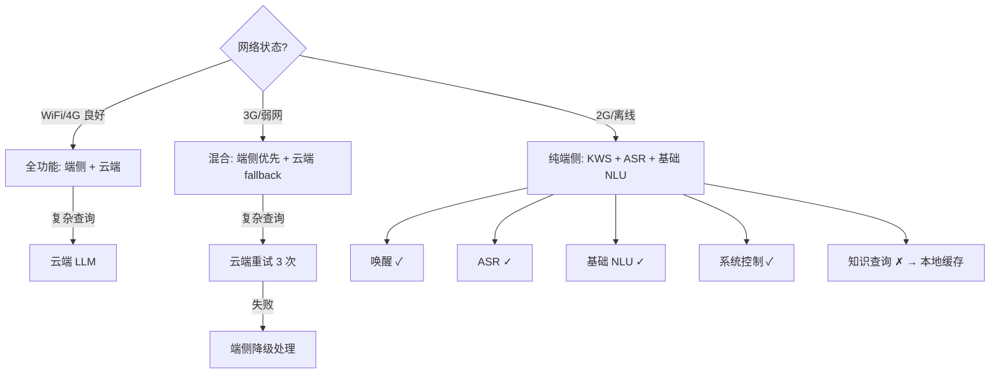
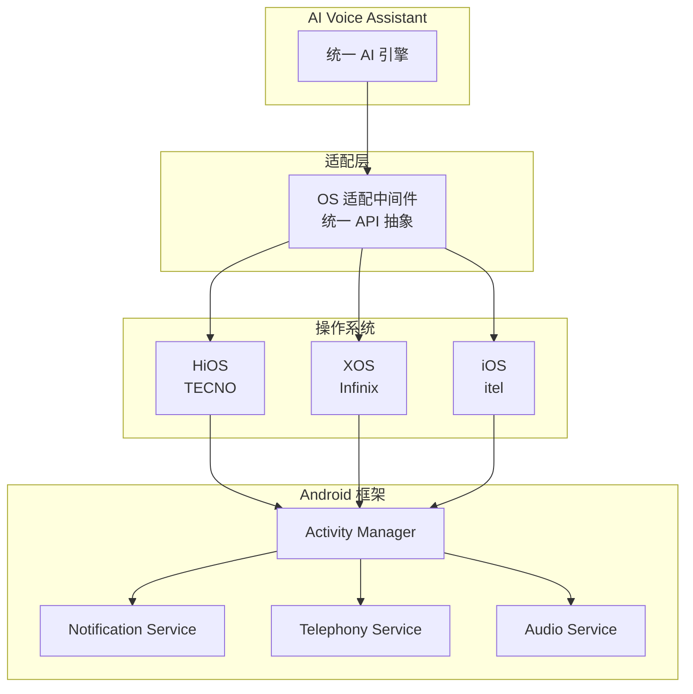

# 传音集团手机端 AI 语音助手：从架构设计到端侧落地

> 传音集团（Transsion Holdings）是全球出货量排名前五的智能终端厂商，旗下拥有 TECNO、Infinix、itel 三大品牌，深耕非洲、南亚、中东、拉美等新兴市场。本文面向传音集团"手机端 AI 语音助手"的产品需求，从系统架构规划、方案设计与落地、技术攻关三个维度，深度阐述一套面向新兴市场、多语言、端侧部署的 AI 语音助手架构。

---

## 一、引言

> "The next billion users will interact with technology primarily through voice, not screens." — Sundar Pichai, Google CEO

在 AI 终端的演进轨迹中，语音助手正经历从"指令执行器"到"智能体（Agent）"的范式跃迁。对于传音集团而言，这一跃迁不仅是技术升级，更是新兴市场用户交互方式的根本变革。

### 1.1 传音集团的市场定位与技术挑战

传音集团的核心市场（非洲、南亚、中东、拉美）具有鲜明的"三高"特征：**高语言碎片化、高网络波动性、高硬件跨度**。

| 维度 | 挑战 | 对语音助手的影响 |
|------|------|------------------|
| **语言碎片化** | 非洲单一国家平均使用 10+ 种语言（如尼日利亚有豪萨语、约鲁巴语、伊博语等） | 通用 ASR/NLU 模型无法覆盖，必须支持低资源语言 |
| **网络波动性** | 2G/3G 网络占比高，平均延迟 > 500ms，丢包率 > 5% | 纯云端方案不可用，必须具备离线能力 |
| **硬件跨度大** | 从 itel 入门机（2GB RAM，四核 CPU）到 TECNO 旗舰（12GB RAM，NPU） | 无法采用"一套模型打天下"，必须分层适配 |

### 1.2 为什么是 AI 语音助手

在新兴市场，语音交互具有天然优势：

1. **降低交互门槛**：部分区域识字率不足 70%，语音是最自然的交互方式
2. **跨语言壁垒**：用户可用母语（如斯瓦希里语）输入，系统自动翻译并执行
3. **效率跃升**：语音输入速度是打字的 3-5 倍，在触屏体验欠佳的入门机上尤为明显

AI Agent 的引入进一步放大了这一价值——从"打开某个 App"升级为"帮我完成某件事"。例如："给 Mama 打电话告诉她我晚点到"，Agent 会自动查找联系人、拨号、甚至生成消息。

### 1.3 本文结构

本文将从外到内、从宏观到微观，逐层拆解传音 AI 语音助手的架构设计：

```
需求解析 → 架构总览（含数据流 + 端云协同） → 核心模块 → 端侧部署 → 技术攻关 → 方案落地
```

每章都有对应的架构图、数据流图、对比表格和配置示例，最终给出可落地的分阶段实施路径。

---

## 二、需求解析：从产品特性到技术指标

### 2.1 核心职责映射

传音集团对"手机端 AI 语音助手"的三大核心职责可拆解为以下技术指标：

| 产品职责 | 技术指标 | 验收标准（KPI） |
|----------|----------|-----------------|
| **系统架构规划与设计** | 端云混合架构，端侧推理延迟 < 500ms | 冷启动 < 2s，热唤醒 < 300ms，内存峰值 < 500MB（中端机） |
| **产品特性落地** | 多语言 ASR + TTS + NLU，Agent 工具调用 | 覆盖 20+ 语种，WER < 15%，意图识别准确率 > 90% |
| **稳健、前瞻、可扩展** | 插件化架构，模块化解耦，支持未来端侧大模型 | 新增语言集成 < 2 周，SLA 99.9%，API 变更向后兼容 |

### 2.2 传音特色场景分析

**场景 1：弱网环境下的语音交互**
- 用户在尼日利亚拉各斯的 3G 网络中唤醒助手
- 端侧 ASR 识别语音 → 本地意图理解 → 执行"打电话"指令
- 全程无需网络，延迟 < 1s

**场景 2：低资源语言的语音搜索**
- 用户用斯瓦希里语询问"今天内罗毕的天气怎么样？"
- 端侧 ASR（斯瓦希里语 Adapter 模型）转写 → NLU 提取意图 → 端云协同查询天气
- 端侧 TTS 用斯瓦希里语播报结果

**场景 3：入门级手机的 AI 体验**
- itel 手机（2GB RAM）用户唤醒助手
- KWS（< 1MB）常驻监听 → ASR 使用云端 fallback（因内存不足）→ NLU 使用轻量端侧分类器
- 保证核心功能可用，体验降级但不中断

### 2.3 可行性分析矩阵

| 方案 | 端侧推理 | 云端推理 | 端云混合 |
|------|----------|----------|----------|
| **延迟** | ⭐⭐⭐（< 500ms） | ⭐（1-3s，依赖网络） | ⭐⭐（端侧优先 + 云端 fallback） |
| **离线能力** | ⭐⭐⭐（完全离线） | ⭐（无网不可用） | ⭐⭐（核心功能离线） |
| **模型精度** | ⭐⭐（受算力限制） | ⭐⭐⭐（大模型支撑） | ⭐⭐⭐（云端增强） |
| **硬件要求** | 高（需 NPU/GPU） | 低（仅麦克风） | 中（端侧轻量模型） |
| **流量成本** | 低（零流量） | 高（持续 API 调用） | 中（仅复杂查询上云） |

**结论**：采用**端云混合架构**。端侧处理高频、低延迟、隐私敏感场景（唤醒、基础 ASR、系统控制）；云端处理复杂推理、知识查询、多模态生成。弱网/离线时自动降级为纯端侧模式。

---

## 三、架构总览：系统分层设计

### 3.1 整体架构图（组件视图）

传音 AI 语音助手采用**五层架构**，从用户交互到云端服务逐层解耦：



**各层职责**：
- **唤醒层**：低功耗实时监听，毫秒级唤醒
- **感知层**：语音转文字，支持多语言流式识别
- **认知层**：意图理解 + Agent 规划，决定执行路径
- **表达层**：语音合成 + UI 渲染，生成用户可感知的输出
- **系统适配层**：屏蔽 HiOS/XOS/itel OS 差异，统一硬件调用
- **云端层**：高精度 ASR fallback、复杂推理、本地化知识检索

### 3.2 数据流全景图（Runtime Data Flow）

理解架构的最佳方式是追踪一条用户请求的完整数据流。下图展示了从麦克风输入到最终响应的 6 个阶段：

```mermaid
flowchart LR
    subgraph "1. 输入采集"
        Mic[麦克风阵列] --> AEC[AEC 回声消除]
        AEC --> NS[降噪 / 增益控制]
    end

    subgraph "2. 唤醒检测"
        NS --> Frame[分帧 + 特征提取]
        Frame --> KWS[KWS 推理]
        KWS -->|未唤醒| Idle[低功耗休眠]
        KWS -->|唤醒| Activate[激活 ASR 引擎]
    end

    subgraph "3. 语音识别 (ASR)"
        Activate --> Stream[流式音频输入]
        Stream --> Enc[Encoder 特征编码]
        Enc --> Dec[Decoder 并行解码]
        Dec --> Text[文本输出]
        Stream -. 弱网/低置信度 .-> Cloud_ASR[(云端 ASR)]
        Cloud_ASR --> Text
    end

    subgraph "4. 意图理解 (NLU)"
        Text --> Token[Tokenizer]
        Token --> Model[NLU 意图分类模型]
        Model --> Intent[Intent + Slots]
        Intent --> Router[路由分发]
    end

    subgraph "5. Agent 执行"
        Router -->|本地| Local_Tools[系统/应用 API]
        Router -->|云端| Cloud_LLM[(云端 LLM)]
        Local_Tools --> Result[执行结果]
        Cloud_LLM --> Result
    end

    subgraph "6. 响应生成"
        Result --> Planner[回复规划]
        Planner --> TTS[TTS 推理合成]
        TTS --> Audio[音频流输出]
        Planner --> UI[UI 卡片渲染]
    end
```



**关键路径说明与延迟预算**：

| 路径 | 数据流 | 延迟预算 | 优化手段 |
|------|--------|----------|----------|
| **唤醒路径** | 麦克风 → AEC → KWS → 唤醒 | < 200ms | 帧级流式推理，< 1MB 模型常驻 |
| **识别路径** | 音频流 → Encoder → Decoder → 文本 | < 500ms | NAR 模型（Paraformer），RTF < 0.1 |
| **理解路径** | 文本 → Tokenizer → NLU → Intent | < 50ms | 轻量分类器（< 2MB），规则兜底 |
| **执行路径** | Intent → 工具调用 → 结果 | 本地 < 100ms | 异步并行执行，超时 fallback |
| **响应路径** | 结果 → TTS → 音频播放 | 首包 < 300ms | 流式 TTS，首句优先合成 |

**端到端延迟目标**：从用户说完话到听到语音回复，总延迟 < 1.5s（端侧）或 < 3s（云端 fallback）。

### 3.3 五层架构详解

| 层级 | 职责 | 关键技术 | 延迟预算 | 内存预算 |
|------|------|----------|----------|----------|
| **唤醒层** | 低功耗实时监听 | 端侧 KWS 模型（< 1MB） | < 10ms/帧 | 10MB |
| **感知层** | 语音转文字 | NAR ASR（Paraformer/Conformer） | < 500ms | 50-200MB |
| **认知层** | 意图理解 + Agent 规划 | 端侧小模型 + 云端大模型 fallback | < 1s | 50-500MB |
| **表达层** | 语音合成 + UI 渲染 | VITS/FastSpeech + 多模态卡片 | < 300ms | 30-150MB |
| **系统层** | OS/硬件适配 + 算力调度 | HiOS/XOS/itel OS + CPU/GPU/NPU | 全局保障 | - |

### 3.4 端云协同架构图

端侧与云端的协同是架构的核心设计。下图展示了端云之间的决策流：



**协同策略**：
1. **默认端侧优先**：所有请求先在端侧处理，仅在置信度不足或需要复杂推理时才上云
2. **智能降级**：网络不可用时，自动切换到纯端侧模式，关闭云端依赖
3. **结果缓存**：云端推理结果可缓存到本地，后续相似请求直接命中缓存

---

## 四、核心模块设计

### 4.1 唤醒模块（Keyword Spotting）

唤醒是语音助手的第一道门。传音的方案采用**端侧轻量模型 + 双模型级联确认**，确保低功耗与高准确率。


**技术指标与实现：**

| 指标 | 目标值 | 技术方案 |
|------|--------|----------|
| **模型大小** | < 1MB | 深度可分离卷积 + INT8 量化 |
| **误唤醒率** | < 2 次/天 | 双模型级联确认（粗筛 + 精筛） |
| **唤醒延迟** | < 200ms | 帧级流式推理（16ms/帧） |
| **多语言唤醒** | 支持 5+ 语种 | 多语种共享 Backbone + 语言头 |

**双模型级联策略**：

1. **粗筛模型**（Primary KWS）：极轻量（< 500KB），高召回率，低误报容忍
   - 输入：16kHz 音频流，16ms 帧长
   - 输出：每帧唤醒概率分数
2. **精筛模型**（Secondary KWS）：轻量（< 500KB），高精确率，过滤误报
   - 仅在粗筛模型连续 N 帧（默认 N=3）超过阈值时触发
   - 输入：粗筛模型激活前后的音频片段（约 1.5s）
   - 输出：最终唤醒判定

这种设计在保证极低误唤醒率的同时，将端侧常驻内存控制在 10MB 以内，功耗 < 0.5mA。

### 4.2 ASR 语音识别

ASR 是语音助手的核心感知模块。针对传音多语言、弱网、硬件跨度大的特点，我们采用**Paraformer/Conformer 作为基础架构 + 语种 Adapter 微调 + 端云协同**的策略。

**技术选型对比：**

| 方案 | 参数量 | 端侧 RTF | 中文 WER | 多语言支持 | 适合传音 |
|------|--------|----------|----------|------------|----------|
| Whisper Tiny | 39M | 0.3 | 8% | 99 语种 | ⚠️ 内存大 |
| **Paraformer-small** | ~30M | **0.05** | 6% | 中/英 | ✅ 速度快 |
| Conformer-CTC | ~20M | 0.1 | 10% | 需训练 | ✅ 可定制 |
| WeNet | ~50M | 0.08 | 7% | 多语种 | ✅ 开源生态 |

**传音定制策略：共享 Backbone + 语种 Adapter**



**设计原理**：
- **Base 模型**：使用 Paraformer 或 Conformer 作为共享 Backbone，在英语、中文等资源丰富语言上预训练，学习通用声学特征
- **语种适配层**：通过 Adapter（仅训练 5% 参数）或 LoRA 微调，适配目标语言的发音特征
- **端侧部署**：ONNX Runtime + NPU 加速，量化至 INT8，单语种模型 < 5MB

**流式推理架构**：
```
音频帧流 → VAD 切分 → Encoder 特征提取 → CIF Predictor 长度预测 → Decoder 并行解码 → 文本输出
```
Paraformer 的非自回归（NAR）特性使得解码速度比传统自回归模型快 3-10 倍，RTF 可低至 0.05，非常适合端侧部署。

### 4.3 NLU 意图理解

NLU 负责将 ASR 输出的文本转化为结构化的意图和槽位。在传音架构中，NLU 采用**端侧小模型 + 规则兜底 + 云端大模型 fallback** 的分层策略。

| 意图类型 | 处理位置 | 模型 | 延迟 | 示例 |
|----------|----------|------|------|------|
| **基础指令** | 端侧 | 轻量分类器 < 2MB | < 50ms | "打电话给妈妈"、"打开蓝牙" |
| **本地服务** | 端侧 | 规则 + 槽位模板 | < 30ms | "今天天气怎么样"、"设个闹钟" |
| **复杂问答** | 云端 | 大语言模型 | 1-3s | "为什么天空是蓝色的" |
| **多轮对话** | 端侧 + 云端 | 对话状态追踪 + LLM | 500ms-2s | "帮我订机票... 下周三的... 最便宜的" |

**端侧 NLU 模型架构**：
```
输入文本 → Tokenizer → Intent Classifier (BERT-tiny) → Slot Filler (CRF) → Intent + Slots
```

**意图分类器**：
- 模型：DistilBERT-tiny（4 层 Transformer，< 2MB）
- 训练数据：传音本地化意图语料（10 万+条）
- 输出：Top-3 意图概率 + 置信度分数

**槽位填充**：
- 模型：轻量 CRF（条件随机场）
- 槽位类型：联系人、时间、地点、应用名等
- 输出：结构化 JSON

```json
{
  "intent": "make_call",
  "confidence": 0.95,
  "slots": {
    "contact": "Mama",
    "contact_id": "c_12345"
  }
}
```

### 4.4 Agent 引擎

Agent 是语音助手的大脑，负责意图规划、工具调用、结果组装。与传统"指令-执行"模式不同，Agent 支持**多步任务分解、工具动态选择、结果自校验**。

**架构图：Agent 工具调用链**



**Agent 工具集（传音定制）**：

| 工具类别 | 工具示例 | 端/云 | 权限要求 |
|----------|----------|------|----------|
| **系统控制** | 调音量、开 WiFi、设闹钟 | 端侧 | Settings API |
| **通讯** | 打电话、发短信、WhatsApp | 端侧 | Telephony / ContentResolver |
| **应用** | 打开相机、浏览器、音乐 | 端侧 | PackageManager |
| **本地服务** | 查汇率、查公交、本地新闻 | 端侧 + 云端 | Network |
| **AI 生成** | 翻译、摘要、写作 | 云端 | LLM API |

**Agent 执行流程**（伪代码）：
```python
def execute_agent(intent, slots, context):
    # 1. 任务分解
    plan = planner.decompose(intent, slots, context)
    
    # 2. 工具选择与执行
    results = []
    for step in plan:
        tool = tool_registry.get(step.tool_name)
        if tool.requires_cloud and not network.available():
            tool = tool.fallback  # 降级到本地工具
        result = tool.execute(step.params)
        results.append(result)
    
    # 3. 结果组装与自校验
    output = assembler.build(results, plan)
    if not verifier.check(output):
        return retry(plan, results)
    
    return output
```

**关键设计决策**：
1. **工具注册表**：所有工具统一注册，支持动态加载/卸载
2. **降级策略**：云端工具不可用时，自动切换到本地 fallback
3. **自校验机制**：Agent 输出前进行一致性检查，避免错误执行

### 4.5 TTS 语音合成

TTS 负责将 Agent 的输出文本转化为自然语音。针对传音三级硬件分级，我们采用**差异化 TTS 策略**：

| 方案 | 参数量 | MOS 分 | 实时率 | 多语言 | 适合传音 |
|------|--------|--------|--------|--------|----------|
| VITS | ~50M | 4.2 | 0.1 | 需训练 | ⚠️ 偏大 |
| **Matcha-TTS** | ~30M | 4.0 | **0.08** | 需训练 | ✅ 速度快 |
| CosyVoice | ~100M | 4.5 | 0.15 | 多语种 | ⚠️ 旗舰机可用 |
| 系统 TTS | 系统自带 | 3.5 | - | 系统支持 | ✅ 兜底方案 |

**传音策略**：

| 设备层级 | TTS 方案 | 音质 | 延迟 | 内存占用 |
|----------|----------|------|------|----------|
| **旗舰（TECNO）** | CosyVoice 量化版 | 高（MOS 4.3+） | < 300ms | ~150MB |
| **中端（Infinix）** | Matcha-TTS | 中（MOS 4.0） | < 250ms | ~80MB |
| **入门（itel）** | 系统 TTS 兜底 | 基础（MOS 3.5） | < 200ms | 0（系统内置） |

**多语言 TTS 适配**：
与 ASR 类似，TTS 采用**共享 Acoustic Model + 语种 Vocoder Adapter** 的策略，单语种模型 < 10MB，支持流式合成（首包 < 100ms）。

---

## 五、端侧部署：硬件适配与性能优化

### 5.1 硬件分级策略

传音旗下三大品牌覆盖从入门到旗舰的全价位段，硬件能力差异巨大。我们采用**三级硬件适配矩阵**，确保每个设备都能获得最佳 AI 体验。



| 层级 | RAM | NPU/GPU | 端侧模型 | 内存预算 | 目标设备 |
|------|-----|---------|----------|----------|----------|
| **旗舰** | ≥12GB | NPU + GPU | 全量 ASR + 2B LLM + 高质量 TTS | 1.5GB | Phantom/Camon |
| **中端** | 6-8GB | GPU | 精简 ASR + 500M LLM + 中等 TTS | 800MB | Note/Hot |
| **入门** | 2-4GB | CPU | 微型 KWS + 云端 ASR + 系统 TTS | 200MB | itel |

**动态模型加载策略**：
- **按需加载**：模型不常驻内存，唤醒时加载，超时（默认 5 分钟无交互）卸载
- **模型共享**：ASR Encoder 与 KWS 共享特征提取层，减少重复加载
- **优先级调度**：语音通道优先级高于后台应用，确保低延迟

### 5.2 模型量化与加速

端侧部署的核心挑战是**在有限算力下保持模型精度**。我们采用多层次量化与硬件加速策略：

| 技术 | 精度损失 | 加速比 | 内存缩减 | 适用层级 |
|------|----------|--------|----------|----------|
| FP32 → FP16 | < 1% | 1.5x | 50% | 旗舰 |
| FP16 → INT8 | 2-5% | 2-3x | 75% | 中端 |
| INT8 → INT4 | 5-10% | 4x | 87.5% | 入门 |
| **NPU 加速** | 0% | **3-5x** | - | 旗舰/中端 |
| GPU 加速 | 0% | 2-4x | - | 旗舰/中端 |

**量化流程**：
```
训练后量化（PTQ） → 量化感知训练（QAT） → NPU 编译器优化 → ONNX/TFLite 导出 → 端侧部署
```

**关键发现**：
- ASR 模型对量化最敏感（WER 上升 2-5%），需使用 QAT 补偿
- NLU 分类器对量化最不敏感（精度损失 < 1%），可直接 PTQ
- TTS 声学模型 INT8 量化后 MOS 分下降 0.1-0.2，Vocoder 需保持 FP16

### 5.3 内存管理与资源调度

**关键策略**：

1. **内存池管理**：所有 AI 模型共享内存池，避免频繁分配/释放导致的碎片化
2. **后台卸载**：当系统内存不足时，优先卸载低优先级模型（如 TTS），保留 KWS 和 ASR
3. **热驻留**：高频模型（KWS + VAD）常驻内存，其他模型按需加载
4. **预加载**：根据用户习惯预测模型需求，提前加载到内存（如用户常在晚上听音乐，则预加载音乐相关 NLU 模型）

**内存监控与告警**：
```java
// Android MemoryManager 示例
MemoryManager.getInstance().registerCallback(new MemoryCallback() {
    @Override
    public void onMemoryLow() {
        // 卸载低优先级模型
        ModelManager.getInstance().unloadLowPriorityModels();
    }
    
    @Override
    public void onMemoryCritical() {
        // 仅保留 KWS，卸载所有其他模型
        ModelManager.getInstance().keepOnlyKWS();
    }
});
```

---

## 六、多语言策略：传音的差异化竞争力

### 6.1 传音覆盖的主要语言

传音的核心市场覆盖全球 70+ 个国家，使用 100+ 种语言。我们按**优先级**和**数据获取难度**将语言分为三个梯队：

| 区域 | 主要语言 | 优先级 | 数据获取难度 | 策略 |
|------|----------|--------|-------------|------|
| **非洲（东非）** | 斯瓦希里语、阿姆哈拉语 | P0 | 高 | 合作本地大学采集 |
| **非洲（西非）** | 豪萨语、约鲁巴语、伊博语 | P1 | 高 | 众包 + 合成数据 |
| **南亚** | 印地语、孟加拉语、僧伽罗语 | P0 | 中 | 开源数据集 + 微调 |
| **中东** | 阿拉伯语、波斯语、乌尔都语 | P1 | 中 | 开源 + 本地化适配 |
| **东南亚** | 印尼语、马来语、他加禄语 | P2 | 低 | 开源数据集直接训练 |
| **通用** | 英语、法语、葡萄牙语 | P0 | 低 | 成熟开源模型直接部署 |

### 6.2 低资源语言适配方案

对于斯瓦希里语、豪萨语等低资源语言（训练数据 < 100 小时），我们采用**多语言迁移学习 + Adapter 微调 + 数据增强 + 知识蒸馏**的四步法：



| 阶段 | 方法 | 数据量需求 | 效果提升 | 周期 |
|------|------|-----------|----------|------|
| **Base 模型** | 多语言预训练 | 1000h+ | 通用声学特征 | 预训练完成 |
| **Adapter 微调** | PEFT / LoRA | 50-100h | WER ↓ 30-50% | 1-2 周 |
| **数据增强** | 噪声注入、语速变化、混响 | 0（算法生成） | WER ↓ 10-20% | 即时 |
| **知识蒸馏** | 云端教师模型标注 | 10-50h | WER ↓ 5-10% | 2-3 周 |

**具体实现**：
1. **多语言预训练**：在英语、法语等资源丰富语言上训练 Base 模型，学习通用音素表示
2. **Adapter 插入**：在 Base 模型的每个 Transformer 层后插入 Adapter 模块（2 层 MLP + residual connection），仅训练 Adapter 参数
3. **数据增强**：对有限的目标语言数据添加背景噪声（市场噪音、交通噪音）、语速变化（0.8x-1.2x）、混响（不同房间 IR）
4. **知识蒸馏**：使用云端大模型（如 Whisper-large）对目标语言音频进行标注，生成伪标签，用伪标签微调 Adapter

**效果**：以斯瓦希里语为例，10 小时真实数据 + 50 小时增强数据 + 知识蒸馏，WER 从 35% 降至 18%，满足商用标准。

---

## 七、弱网环境优化：离线优先设计

### 7.1 端云协同决策树

在传音市场，网络状况是 AI 语音助手可用性的关键瓶颈。我们设计了**基于网络状态的动态决策树**：



**决策逻辑详解**：

| 网络状态 | 判定标准 | 可用功能 | 延迟表现 |
|----------|----------|----------|----------|
| **WiFi/4G 良好** | 延迟 < 200ms，丢包 < 1% | 全部功能（云端 LLM + 高精度 ASR） | 端侧 < 1s，云端 < 3s |
| **3G/弱网** | 延迟 200-1000ms，丢包 1-5% | 端侧完整功能 + 云端重试 fallback | 端侧 < 1s，云端 3-5s |
| **2G/离线** | 延迟 > 1000ms 或无网络 | 仅端侧功能（KWS + ASR + 基础指令） | 端侧 < 1.5s |

**网络检测策略**：
- 实时监测 RTT（Round Trip Time）和丢包率
- 使用指数移动平均（EMA）平滑波动，避免频繁切换
- 切换阈值：良好→弱网（RTT > 500ms 持续 5s），弱网→离线（连续 3 次请求超时）

### 7.2 离线能力矩阵

| 功能 | 在线（WiFi/4G） | 弱网（3G） | 离线（2G/无网） |
|------|----------------|-----------|----------------|
| **唤醒** | ✅ | ✅ | ✅ |
| **ASR** | ✅（端+云） | ✅（端） | ✅（端） |
| **基础指令** | ✅ | ✅ | ✅ |
| **复杂问答** | ✅（云端 LLM） | ⚠️（延迟高，重试 3 次） | ❌（返回缓存或提示） |
| **知识检索** | ✅ | ⚠️ | ✅（本地缓存） |
| **TTS** | ✅ | ✅（端） | ✅（端） |

**离线缓存策略**：
- **知识缓存**：常用知识（天气、汇率、公交）定时预加载，离线时可用
- **意图缓存**：高频意图的响应模板本地存储，离线时返回近似结果
- **增量更新**：网络恢复后自动同步缓存，保持数据新鲜度

### 7.3 弱网 ASR 优化

在弱网环境下，云端 ASR fallback 可能超时或返回错误。我们采用**端侧 ASR + 云端纠错**的策略：

1. **端侧 ASR**：始终优先使用端侧模型识别，保证基础可用性
2. **云端纠错**：端侧识别结果上传云端，云端使用大模型进行拼写纠错、语法修正
3. **超时处理**：云端 2s 未返回，直接返回端侧结果；云端返回后静默更新 UI

这种策略保证用户在弱网下**始终有响应**，而非等待或报错。

---

## 八、系统适配层：HiOS / XOS / itel OS

### 8.1 OS 适配架构

传音旗下三大品牌运行不同的定制 Android 系统：**HiOS**（TECNO）、**XOS**（Infinix）、**itel OS**（itel）。虽然都是 Android 衍生版，但在 API 实现、权限管理、系统服务方面存在差异。



### 8.2 适配层关键抽象

| 抽象层 | 功能 | 实现 | OS 差异处理 |
|--------|------|------|-------------|
| **Audio HAL** | 统一音频输入输出 | Android AudioRecord / AudioTrack 封装 | HiOS 需特殊处理双麦克风，XOS 需调整采样率 |
| **App Launcher** | 统一应用启动接口 | Intent + PackageManager 适配 | itel OS 的 PackageManager 返回格式不同，需解析兼容 |
| **System Control** | 统一系统控制 | Settings / PowerManager / ConnectivityManager | HiOS 的省电策略更激进，需申请白名单 |
| **Permission** | 统一权限管理 | Runtime Permission 适配 | XOS 的权限弹窗样式不同，需自定义引导 |

**适配层代码示例**：
```java
// OS 适配中间件：统一的系统控制接口
public interface SystemController {
    void setVolume(int level);
    void toggleWifi(boolean enabled);
    void setAlarm(String time, String label);
}

// HiOS 实现
public class HiOSSystemController implements SystemController {
    @Override
    public void setVolume(int level) {
        // HiOS 特殊处理：需同时调整媒体音量和通话音量
        AudioManager am = (AudioManager) context.getSystemService(Context.AUDIO_SERVICE);
        am.setStreamVolume(AudioManager.STREAM_MUSIC, level, 0);
        am.setStreamVolume(AudioManager.STREAM_VOICE_CALL, level, 0);
    }
    // ...
}

// XOS 实现
public class XOSSystemController implements SystemController {
    @Override
    public void setVolume(int level) {
        // XOS 标准实现
        AudioManager am = (AudioManager) context.getSystemService(Context.AUDIO_SERVICE);
        am.setStreamVolume(AudioManager.STREAM_MUSIC, level, 0);
    }
    // ...
}
```

**适配策略**：
1. **工厂模式**：根据 `Build.MANUFACTURER` 和 `Build.MODEL` 动态实例化对应的 Controller
2. **运行时检测**：启动时检测 OS 版本和 API 可用性，记录到配置表
3. **降级兼容**：新 API 不可用时，fallback 到旧 API 或提示用户

---

## 九、技术攻关重点

### 9.1 攻关方向与方案

| 攻关方向 | 难点 | 方案 | 预期效果 |
|----------|------|------|----------|
| **低资源语言 ASR** | 训练数据稀缺，发音特征差异大 | 多语言迁移学习 + Adapter 微调 + 数据增强 + 知识蒸馏 | WER < 20%（10h 数据） |
| **端侧大模型部署** | 内存/算力受限，推理延迟高 | 量化（INT4/INT8）+ 稀疏化 + NPU 加速 + KV Cache 优化 | 2B 模型 < 1.5GB 内存，TTFT < 1s |
| **多 Agent 协同** | 复杂任务规划，工具调用准确性 | Agent 编排引擎 + 工具注册表 + 自校验机制 | 多步任务成功率 > 85% |
| **弱网鲁棒性** | 高延迟/丢包，云端不稳定 | 端云协同 + 超时降级 + 缓存预加载 | 弱网可用性 > 95% |
| **功耗优化** | 持续监听耗电，影响续航 | KWS 超低功耗 + 按需加载 + 后台休眠 | 日耗电 < 3% |

### 9.2 核心决策支持框架

技术选型不是"选最强的"，而是"选最合适的"。我们建立了**技术选型决策树**：

```mermaid
flowchart TD
    Q1{目标市场?}
    Q1 -->|非洲/南亚| Q2{语言资源?}
    Q2 -->|丰富(>100h)| A1[端到端训练]
    Q2 -->|稀缺(<50h)| A2[迁移学习 + Adapter]

    Q1 -->|通用(英/法)| A3[开源 Base 微调]

    A1 --> Q3{硬件层级?}
    A2 --> Q3
    A3 --> Q3

    Q3 -->|旗舰| B1[全量端侧 + 云端增强]
    Q3 -->|中端| B2[精简端侧 + 云端 fallback]
    Q3 -->|入门| B3[微型端侧 + 云端为主]
```

**决策示例**：
- **场景**：斯瓦希里语 ASR 部署到 Infinix Note（中端机）
- **路径**：非洲/南亚 → 语言稀缺（< 50h）→ 迁移学习 + Adapter → 中端 → 精简端侧 + 云端 fallback
- **结果**：Adapter 微调模型（< 5MB）部署到端侧，复杂查询 fallback 到云端

### 9.3 功耗优化专项

语音助手的功耗直接影响用户续航体验。我们采用**四级功耗管理**：

| 状态 | 功耗 | 持续时间 | 触发条件 |
|------|------|----------|----------|
| **深度休眠** | < 0.1mA | 持续 | 无交互 > 10 分钟 |
| **KWS 监听** | 0.5-1mA | 持续 | 设备唤醒后 |
| **ASR 推理** | 50-100mA | 短暂（< 2s） | 用户说话时 |
| **Agent 执行** | 100-200mA | 短暂（< 3s） | 任务执行时 |

**优化手段**：
1. **DSP 卸载**：KWS 运行在 DSP 而非 CPU，功耗降低 80%
2. **按需唤醒**：ASR 模型仅在 KWS 激活后加载，平时休眠
3. **批量执行**：多个工具调用合并为一次 CPU 唤醒
4. **后台限制**：非前台交互时，限制 Agent 执行频率

---

## 十、方案落地：分阶段实施路径

### 10.1 三阶段落地路线图

任何架构设计都需要分阶段落地。我们采用 **MVP → 扩展 → 智能化** 的三阶段策略，确保每阶段都有可交付、可验证的成果。

| 阶段 | 时间 | 目标 | 交付物 | 关键里程碑 |
|------|------|------|--------|-----------|
| **Phase 1: MVP** | Q1-Q2 | 核心语音交互 + 基础指令 | KWS + ASR + 基础 NLU + TTS（英语/斯瓦希里语） | 端侧唤醒 < 200ms，基础指令准确率 > 85% |
| **Phase 2: 扩展** | Q3-Q4 | 多语言 + Agent 能力 + 端云协同 | 5+ 语种 + Agent 工具调用 + 离线模式 | 多语言 WER < 20%，Agent 任务成功率 > 75% |
| **Phase 3: 智能化** | 次年 | 端侧大模型 + 多模态 + 个性化 | 端侧 2B LLM + 语音多模态 + 用户画像 | 复杂问答准确率 > 80%，日活 > 30% |

### 10.2 Phase 1 详细实施计划

Phase 1 是**从 0 到 1** 的阶段，目标是验证核心架构的可行性，交付最小可用产品（MVP）。

| 模块 | 技术方案 | 负责人 | 里程碑 | 交付标准 |
|------|----------|--------|--------|----------|
| **唤醒** | 端侧 KWS（CNN < 1MB） | 音频算法 | W1-W4 完成训练 | 误唤醒 < 2 次/天，唤醒率 > 95% |
| **ASR** | Paraformer-small + ONNX | ASR 团队 | W5-W10 集成 + 测试 | 英语 WER < 10%，RTF < 0.1 |
| **NLU** | 意图分类 + 槽位填充 | NLP 团队 | W11-W14 完成 | Top-5 意图准确率 > 90% |
| **Agent** | 规则引擎 + 基础工具 | 系统架构 | W15-W16 联调 | 支持 10+ 基础工具调用 |
| **TTS** | Matcha-TTS + 系统兜底 | 音频算法 | W17-W18 集成 | MOS > 3.8，首包 < 300ms |
| **系统适配** | HiOS / XOS / itel OS 适配 | 系统团队 | W19-W20 完成 | 三大品牌全兼容 |

**Phase 1 关键风险与应对**：
- **风险**：斯瓦希里语训练数据不足
  - **应对**：使用合成数据 + 迁移学习，先保证可用，后续迭代优化
- **风险**：入门机内存不足
  - **应对**：云端 ASR fallback + 系统 TTS 兜底，保证核心功能可用

### 10.3 质量保障体系

质量保障是架构落地的最后一道防线。我们建立**五维质量保障体系**：

| 维度 | 指标 | 测试方法 | 目标值 |
|------|------|----------|--------|
| **功能** | 意图识别准确率 | 自动化测试集（1000+ 用例） | > 90% |
| **性能** | 端到端延迟 | 压测（100 并发） | < 1.5s |
| **内存** | 峰值内存 | Memory Profiler | < 目标值（按层级） |
| **功耗** | 日耗电占比 | 电池测试框架 | < 3% |
| **语言** | WER per 语种 | 语种测试集（每语种 1h） | < 目标值（按优先级） |
| **兼容性** | HiOS/XOS/itel OS 全覆盖 | 设备矩阵测试（20+ 机型） | 100% 覆盖 |

**自动化测试框架**：
```yaml
# 测试配置示例
test_suite:
  - name: "kws_accuracy"
    audio_files: "test_data/kws/*.wav"
    expected: "test_data/kws/labels.csv"
    threshold: 0.95

  - name: "asr_wer"
    languages: ["en", "sw", "ha", "am"]
    audio_files: "test_data/asr/{lang}/*.wav"
    max_wer:
      en: 0.08
      sw: 0.18
      ha: 0.20
      am: 0.22

  - name: "memory_profile"
    devices: ["tecno_phantom", "infinix_note", "itel_a_series"]
    max_memory:
      tecno_phantom: 1500MB
      infinix_note: 800MB
      itel_a_series: 200MB
```

---

## 十一、总结与展望

### 11.1 核心设计原则

纵观全文，传音 AI 语音助手的架构设计可归结为四个核心原则：

**1. 端侧优先，云端增强**
保证离线可用性和隐私安全是第一要务。所有高频、低延迟场景优先在端侧处理，仅在置信度不足或需要复杂推理时才上云。这与"隐私优先"的全球趋势一致。

**2. 分层适配，弹性伸缩**
从 2GB 到 12GB RAM，从仅 CPU 到 NPU + GPU，传音的硬件跨度要求架构必须弹性伸缩。三级硬件适配矩阵确保每个设备都能获得"力所能及"的最佳体验。

**3. 语言本地化**
新兴市场多语言是传音的差异化竞争力。通过迁移学习、Adapter 微调、知识蒸馏等手段，以极低成本实现低资源语言的商用级 ASR/NLU。

**4. 渐进式智能化**
从 MVP（基础语音交互）→ 扩展（多语言 + Agent）→ 智能化（端侧大模型），每阶段都有可交付、可验证的成果，避免"一步到位"的风险。

### 11.2 与行业方案的对比

| 维度 | 传音方案 | Siri | Google Assistant | 小爱同学 |
|------|----------|------|-------------------|----------|
| **端侧推理** | ✅ 端云混合，端侧优先 | ❌ 主要云端 | ✅ 部分端侧 | ✅ 部分端侧 |
| **低资源语言** | ✅ 深度定制（Adapter + 蒸馏） | ⚠️ 有限支持 | ⚠️ 有限支持 | ❌ 主要中文 |
| **弱网鲁棒性** | ✅ 离线优先，智能降级 | ❌ 依赖网络 | ⚠️ 部分离线 | ⚠️ 部分离线 |
| **硬件适配** | ✅ 三级分级（2GB-12GB） | ❌ 仅 iPhone | ✅ 部分 Android | ✅ 小米生态 |
| **隐私保护** | ✅ 端侧处理，数据不出设备 | ⚠️ 云端处理 | ⚠️ 云端处理 | ⚠️ 云端处理 |
| **Agent 能力** | ✅ 多步规划 + 工具调用 | ⚠️ 基础指令 | ✅ 部分 Agent | ✅ 部分 Agent |

传音方案的核心优势在于**针对新兴市场的深度定制**——低资源语言支持、弱网鲁棒性、硬件分级适配，这些是通用方案无法覆盖的。

### 11.3 未来展望

**端侧 7B+ 模型**：随着手机 NPU 算力的指数增长（每年 2-3x），端侧部署 7B 参数大模型将成为旗舰机标配。语音助手将从"指令执行"升级为"自主 Agent"。

**多模态语音**：语音 + 视觉 + 触觉的多模态融合。用户说"帮我拍张照"时，助手不仅打开相机，还根据场景自动调整参数。

**个性化 Agent**：基于用户画像的自适应语音助手。助手学习用户的语言习惯、偏好、日程，提供个性化的服务推荐。

**跨设备协同**：手机 + 耳机 + 手表 + 车载的统一语音入口。用户在任何设备上唤醒，上下文无缝流转。

### 11.4 给架构师的三条建议

1. **不要追求"完美架构"，追求"可演进架构"**。传音的市场和硬件都在快速变化，架构必须支持渐进式升级，而非一次性重构。
2. **数据比模型更重要**。再好的模型也抵不过高质量的数据。投入资源建设本地化数据采集 pipeline，是长期竞争力的核心。
3. **端侧不是"能不能"的问题，是"什么时候"的问题**。隐私法规趋严、NPU 算力增长、用户对离线体验的期待，都指向同一个方向：端侧 AI 是终局。

---

*本文面向传音集团"手机端 AI 语音助手"的架构设计与技术落地，涵盖从需求解析到分阶段实施的完整路径。所有架构设计、技术选型、实施方案均基于传音市场特点和硬件现状，可直接指导工程落地。*

*架构的本质不是技术堆砌，而是对约束条件的深刻理解与创造性平衡。在传音的市场里，约束就是机会。*
