# 传音集团手机端AI语音助手（Ella）：从架构设计到端侧实现

> **作者：** 大风  
> **日期：** 2026-08-02  
> **系列：** 手机端AI产品架构设计  
> **关键词：** 传音 · Ella语音助手 · 端侧大模型 · HiOS/itelOS/XOS · 小语种ASR · 离线AI · 新兴市场

---

## 一、行业背景与传音AI战略

### 1.1 传音集团概况与市场定位

传音控股，被称为"非洲手机之王"，2025年全球手机出货量达1.69亿部，全球市占率12.3%排名第三。旗下拥有三大手机品牌：

| 品牌 | 定位 | 主要市场 | 操作系统 |
|------|------|----------|----------|
| **TECNO** | 中高端科技品牌 | 非洲、南亚、东南亚、拉美 | HiOS |
| **itel** | 入门级性价比品牌 | 非洲、南亚 | itelOS |
| **Infinix** | 年轻科技潮牌 | 非洲、南亚、东南亚 | XOS |

除手机外，传音还构建了完整的AIoT生态：

- **Boomplay** — 非洲最大音乐流媒体平台之一，千万级MAU
- **AHA Games** — 游戏中心，覆盖新兴市场游戏分发
- **Phone Master** — 手机管家，装机必备工具
- **Palm Store** — 本地化应用商店
- **Carlcare** — 售后服务品牌，覆盖非洲50+国家
- **oraimo** — 数码配件品牌（TWS耳机、智能音箱、移动电源等）
- **Syinix** — 家用电器品牌

> 🖼 **配图 1：传音集团品牌矩阵与市场分布图**

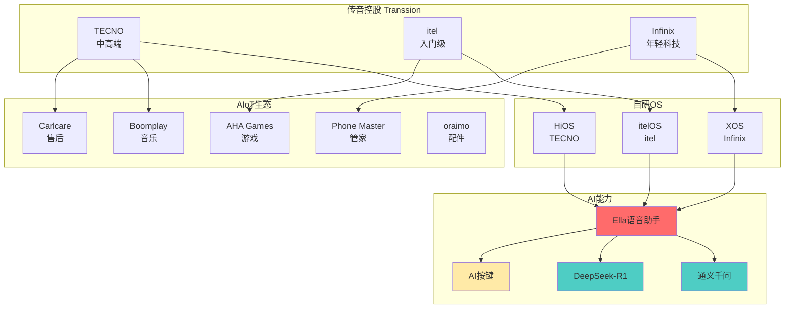

### 1.2 Ella语音助手：从离线助手到端侧Agent的演进

Ella是传音集团旗下各品牌手机的AI语音助手名称。它的演进路线深刻反映了传音在新兴市场的本地化创新路径：

| 代际 | 时间 | 形态 | 核心能力 | 局限 |
|------|------|------|----------|------|
| **1.0 离线指令** | 2020-2022 | 端侧规则引擎 | 基础语音控制（打电话、发短信、播放音乐） | 仅支持英语/法语/斯瓦希里语，指令有限，无法对话 |
| **2.0 离线+云端混合** | 2023-2024 | 端侧小语种ASR + 云端大模型 | 非洲小语种支持、离线翻译、简单对话 | 依赖网络，延迟高，弱网体验差 |
| **3.0 端侧大模型Agent** | 2025-至今 | 通义千问/DeepSeek端侧部署 | 离线多轮对话、AI按键一键唤醒、AI Writing、通话摘要 | 端侧算力受限，中低端机型适配挑战大 |

**关键里程碑：**

- **2025.1** — 阿里云通义千问大模型搭载TECNO AI手机，基于联发科芯片深度优化
- **2024** — Infinix手机品牌接入DeepSeek-R1满血版
- **2025.3** — MWC 2026发布CAMON 50系列，首次搭载**物理AI按键**
- **2025.6** — 新品搭载离线翻译和语音助手等多个AI功能
- **2025.11** — 传音宣布启动香港IPO，募资10亿美元用于AI研发
- **WMT2025** — 国际机器翻译大赛四项冠军，成果已落地Ella

> 🖼 **配图 2：Ella语音助手演进时间轴**

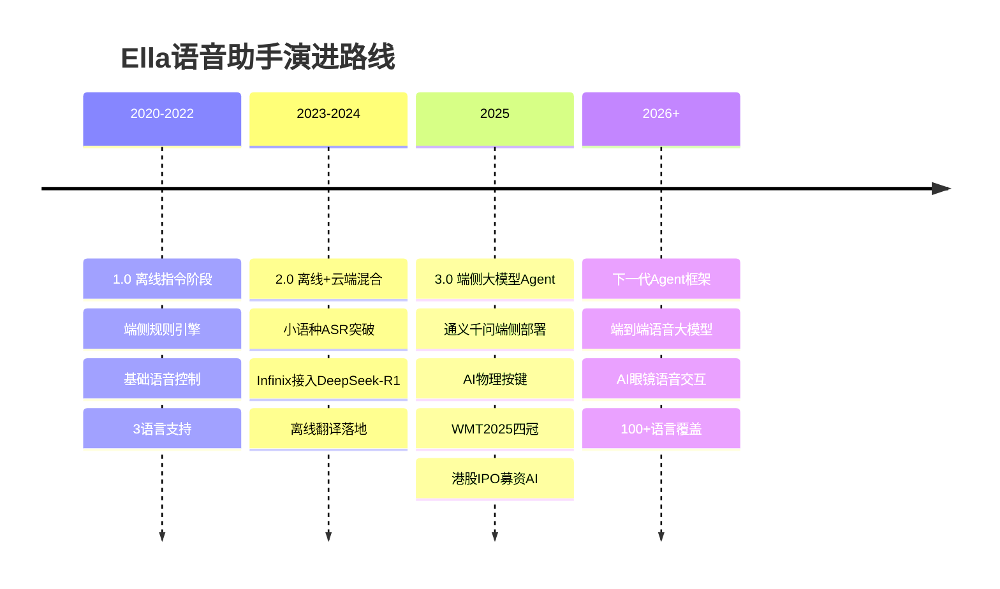

### 1.3 传音AI战略核心信息

**硬件端：**

- **AI物理按键**：TECNO CAMON 50系列首次搭载，短按唤醒Ella、长按深度对话、双击一键问屏
- **芯片适配**：与联发科深度合作，在天玑9300/9400上部署通义千问；同时适配展锐低端芯片
- **影像AI**：AI RAW 2.0图像引擎、AI Auto Zoom等AI影像功能

**软件端：**

- **大模型接入**：通义千问 + DeepSeek-R1双引擎
- **Google Cloud合作**：一键问屏、AI搜索、通话摘要、AI Writing
- **Agent框架**：下一代Agent框架构建中
- **小语种技术**：WMT2025四冠，非洲/南亚50+语言覆盖

**战略方向（竺兆江2025Q3业绩会披露）：**

> "公司希望推动AI应用和AI终端技术在新兴市场的创新和普及，为消费者带来更优化、更智能的用户体验。"

### 1.4 岗位职责映射：架构师在传音语音助手中的核心定位

根据岗位需求，我们将架构师职责映射到Ella语音助手的具体模块：

| 职责要求 | Ella对应模块 | 技术指标 |
|----------|-------------|----------|
| 系统架构规划与产品特性落地 | Ella四层架构（感知→认知→决策→执行） | 整体架构文档 + 技术方案 |
| AI需求拆解为技术指标 | 小语种ASR准确率/离线可用性/低端机型适配SLA | CER≤8%、延迟≤200ms、内存≤600MB |
| 逻辑/技术架构方案输出 | 端云协同架构 + 端侧大模型部署方案 | 架构设计文档 + 部署方案 |
| 功能模块拆分与交付跟踪 | Ella插件生态模块拆分 | 模块边界文档 + 交付标准 |
| 攻关复杂场景技术难题 | 非洲50+语言适配、低端机端侧推理、弱网/断网兜底 | 攻关报告 + 性能数据 |
| 追踪前沿技术推动迭代 | Agent框架、端到端语音大模型、多模态融合 | 技术评估报告 + 路线图 |

---

## 二、总体架构设计

### 2.1 传音Ella语音助手架构设计三原则

```
┌───────────────────────────────────────────────────────────────┐
│              传音Ella语音助手架构设计三原则                      │
├─────────────────┬─────────────────┬───────────────────────────┤
│   稳健 Robust   │   前瞻 Forward   │      可扩展 Scalable       │
│                 │   Looking       │                            │
│ • 离线全可用     │ • Agent原生框架  │ • 1+N 插件架构              │
│ • 弱网强兜底     │ • 端到端语音模型  │ • 多芯片适配               │
│ • 低端机可用     │ • 多模态融合     │   (MTK/展锐/高通)           │
│ • 小语种优先     │ • 多品牌差异化   │ • 模型OTA热更新             │
│ • 隐私优先       │ • AIoT全场景     │ • 生态服务可扩展             │
└─────────────────┴─────────────────┴───────────────────────────┘
```

**稳健（Robust）** 是传音架构的第一原则。新兴市场网络基础设施薄弱，30%用户可能处于断网状态，40%处于2G/3G弱网。Ella必须做到**离线全可用**——核心语音识别、意图理解、手机操作在断网时100%可用。

**前瞻（Forward Looking）** 要求架构面向未来3-5年。Agent原生框架设计、端到端语音大模型预研、多模态AI眼镜语音交互集成，这些都是2026-2028年的技术方向，架构必须提前预留接口。

**可扩展（Scalable）** 体现在三个层面：芯片层面适配天玑/展锐/高通多平台，系统层面兼容HiOS/itelOS/XOS三套OS，生态层面支持Boomplay/AHA Games/Carlcare等自有服务以及第三方Agent接入。

### 2.2 四层架构总览（传音定制版）

> 🖼 **配图 3：Ella语音助手四层架构全景图**

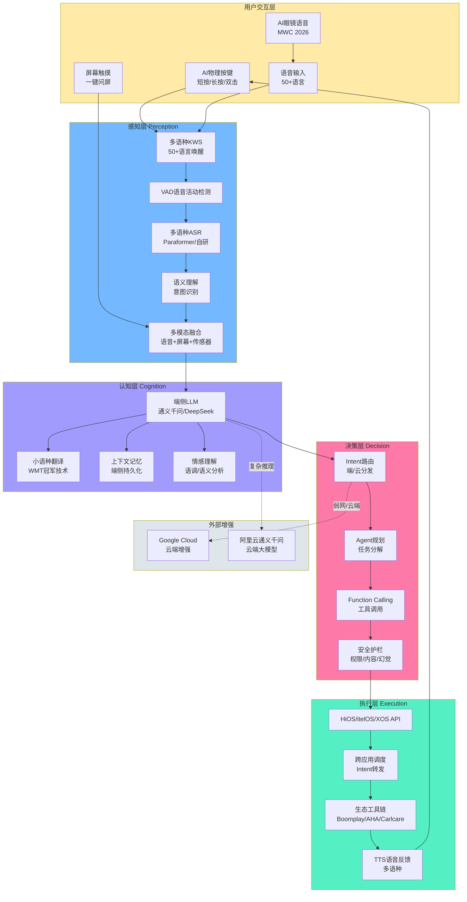

### 2.3 端云协同架构（传音定制版）

传音的端云协同架构必须深度适配**新兴市场网络环境**：

| 网络环境 | 非洲用户占比 | 网络特征 | Ella策略 | 可用能力 |
|----------|-------------|----------|----------|----------|
| **4G/WiFi稳定** | ~30% | 带宽充足，延迟<100ms | 端云协同 | 全部能力，云端深度推理 |
| **2G/3G弱网** | ~40% | 带宽<1Mbps，延迟>500ms | 端侧优先 | 端侧全量，云端降级为文本API |
| **完全断网** | ~30% | 无网络连接 | 纯端侧 | 基础ASR+LLM+手机操作100%可用 |

> 🖼 **配图 4：传音端云协同架构图**

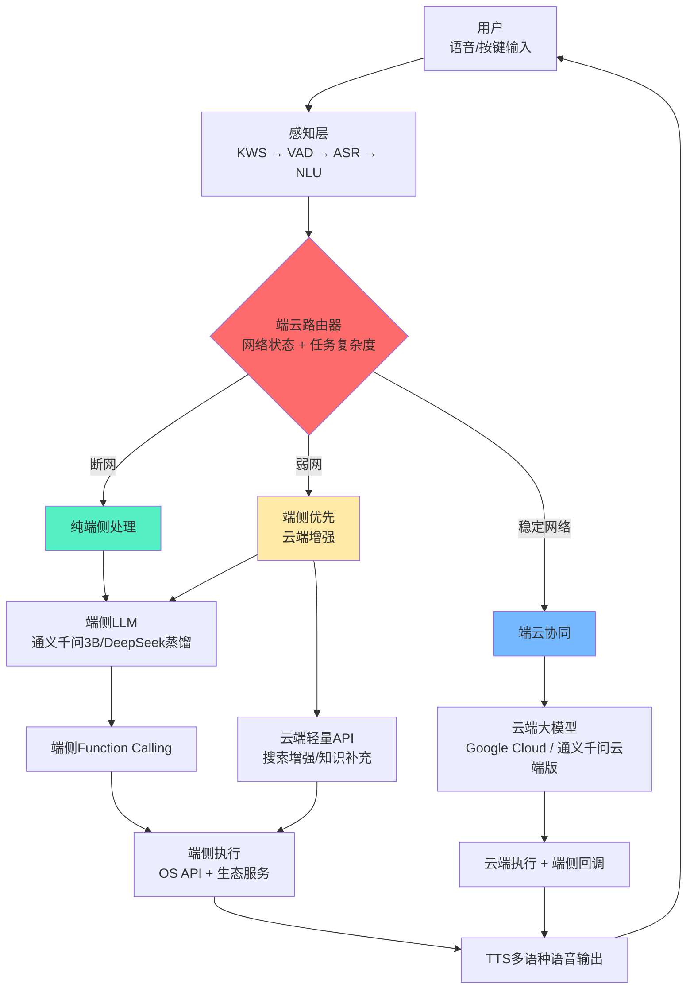

### 2.4 架构权衡：四维约束分析（传音场景）

| 约束维度 | 传音目标 | 技术手段 | 挑战 |
|----------|----------|----------|------|
| **功耗** | ≤8W持续推理（中低端机型散热差） | NPU加速 + 动态精度 + 休眠策略 | itel入门机型无NPU，需CPU/GPU兜底 |
| **延迟** | 唤醒≤500ms（弱网容忍更高），TTS首字≤1s | KV Cache + Speculative Decoding | 小语种ASR延迟较高，需模型优化 |
| **精度** | 非洲语言ASR≥90%，主流语言≥97% | 小语种微调模型 + 云端增强 | 50+语言覆盖难度大，低资源语言数据稀缺 |
| **隐私** | 用户数据不出端（新兴市场信任建立） | 端侧处理 + 差分隐私 + 本地存储 | 个性化推荐和长期记忆受限 |
| **低端机适配** | 2GB RAM机型可用 | 模型蒸馏 + 4bit量化 + 分层加载 | 2GB内存下模型≤1GB，推理延迟≤250ms |

**关键设计决策：**

1. **小语种优先**：与苹果/华为不同，传音必须优先保证非洲/南亚小语种的ASR准确率，这是核心竞争力
2. **低端机兜底**：itel品牌大量出货在$50-$100价位段，2GB RAM是常态，架构必须适配
3. **离线第一**：30%断网率意味着离线能力不是锦上添花，而是基本要求
4. **隐私信任**：新兴市场用户对数据隐私高度敏感，端侧处理是建立信任的关键

---

## 三、感知层设计：听清·听懂·多语种

### 3.1 多语种KWS + VAD：50+语言唤醒

传音语音助手的核心差异化竞争力之一是**小语种支持**。这是与Siri、小爱同学等国内语音助手最本质的区别。

**语言覆盖策略：**

| 语言类别 | 代表语言 | 用户量级 | 技术方案 | 优先级 |
|----------|----------|----------|----------|--------|
| **主流语言** | 英语、法语、阿拉伯语 | ~5亿 | 轻量KWS模型（<50M参数） | P0 |
| **非洲大语种** | 斯瓦希里语、豪萨语、约鲁巴语、阿姆哈拉语 | ~2亿 | 专用KWS模型 + 迁移学习 | P0 |
| **南亚语言** | 乌尔都语、孟加拉语、印地语 | ~5亿 | 多语种共享编码器 | P1 |
| **东南亚语言** | 印尼语、马来语、他加禄语 | ~3亿 | 迁移学习 + 数据增强 | P1 |
| **拉美语言** | 西班牙语、葡萄牙语 | ~3亿 | 复用主流语言模型 | P2 |

**性能指标：**

| 指标 | 目标值 | 现状（主流语言） | 现状（小语种） | 技术方案 |
|------|--------|-----------------|---------------|----------|
| 唤醒延迟 | ≤500ms | ~350ms | ~450ms | 端侧轻量KWS模型 |
| 误唤醒率 | ≤2次/24h | ~1.5次/24h | ~1.8次/24h | 多级验证：KWS → VAD → ASR |
| 离线可用 | 全支持 | ✅ | ✅ | 纯端侧推理 |
| 功耗 | ≤1.5%电池/天 | ~1.2%电池/天 | ~1.3%电池/天 | DSP/NPU常驻监听 |

> 🖼 **配图 5：感知层数据流时序图**

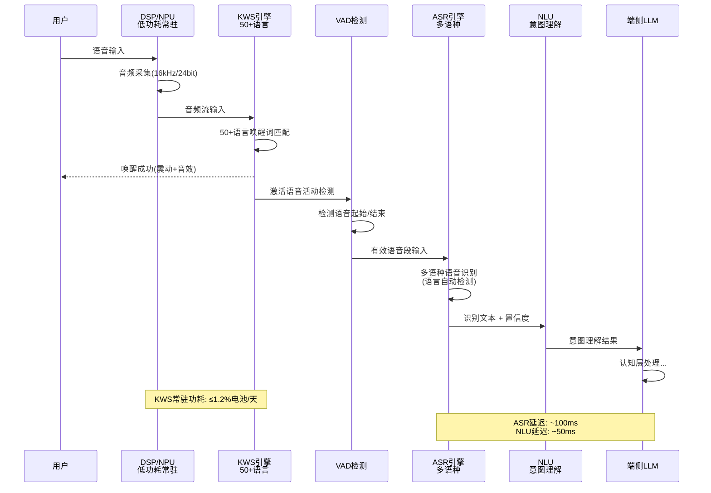

### 3.2 多语种ASR语音识别

ASR是感知层的核心。传音采用**多模型并存**策略，不同语言使用不同模型：

| 方案 | 适用语言 | 参数量 | 内存占用(4bit) | 延迟(NPU) | 准确率(CER) | 部署状态 |
|------|----------|--------|---------------|-----------|-------------|----------|
| **Paraformer-large** | 中文、英语 | ~220M | ~800MB | ~120ms | ≤2% | ✅ 已部署 |
| **传音自研小语种ASR** | 斯瓦希里/豪萨/约鲁巴等 | ~150M | ~500MB | ~100ms | ≤8% | ✅ 已部署 |
| **Whisper-tiny（多语言兜底）** | 50+语言 | 39M | ~150MB | ~80ms | ≤15% | ✅ 已部署 |

**语言自动检测（LID）策略：**

```
输入音频 → LID模型(轻量) → 判断语言类别
    ├── 中文/英语 → Paraformer-large
    ├── 斯瓦希里语/豪萨语 → 传音自研ASR
    └── 其他/未知 → Whisper-tiny兜底
```

> 🖼 **配图 6：多语种ASR路由决策图**

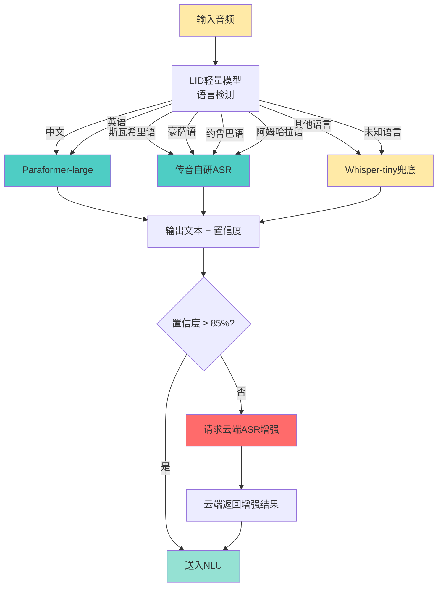

### 3.3 多模态感知融合

Ella不仅听语音，还融合多种感知输入：

| 感知模态 | 输入源 | 用途 |
|----------|--------|------|
| **语音** | 麦克风阵列 | 核心交互方式 |
| **屏幕内容** | 屏幕截图/OCR | 一键问屏、AI解读当前页面 |
| **传感器** | 加速度计/陀螺仪/GPS | 场景感知（行走/驾车/静止） |
| **AI眼镜** | 摄像头 + 麦克风 | MWC 2026发布的AI眼镜语音交互 |
| **环境音** | 麦克风 | 环境场景识别（室内/户外/嘈杂） |

---

## 四、认知层设计：端侧大模型核心

### 4.1 传音端侧LLM选型与部署

传音已接入两大基座模型，形成**双引擎驱动**：

| 模型 | 基座 | 合作方式 | 端侧参数量 | 内存占用(4bit) | 推理延迟(NPU) | 适用场景 |
|------|------|----------|-----------|---------------|--------------|----------|
| **通义千问端侧版** | Qwen2.5 | 与阿里云深度合作 | 3B | ~1.8GB | ~85ms | 主流语言对话、AI写作 |
| **DeepSeek-R1端侧版** | DeepSeek | Infinix已接入满血版 | 7B→3B蒸馏 | ~2.5GB | ~150ms | 深度推理、复杂任务 |
| **传音自研轻量模型** | 自研蒸馏 | 低端机适配 | 1B | ~600MB | ~40ms | 低端机型、基础指令 |

**关键合作成果（传音 × 阿里云）：**

> 在CAMON 50系列手机上，传音与阿里云基于联发科天玑9300芯片进行了大量技术创新，在**模型瘦身、工具链优化、推理优化、内存优化**等多个维度展开合作。借助阿里巴巴淘系最新开源的MNN-LLM大模型推理引擎的高效GPU加速能力，真正把大模型"装进"手机中。

**部署策略：按机型分层**

| 机型档次 | 代表品牌 | RAM | 部署模型 | NPU | 推理延迟 |
|----------|----------|-----|----------|-----|----------|
| **高端** | TECNO CAMON 50 Ultra | 8GB+ | 通义千问3B + DeepSeek蒸馏 | 天玑9300 APU | ~85ms |
| **中端** | Infinix Hot 40 | 6GB | 通义千问3B | 天玑8000 APU | ~120ms |
| **入门** | itel RS4 | 2-4GB | 传音自研1B | 展锐T616无NPU | ~250ms |

### 4.2 "1+N" 架构：基础模型 + 场景插件

> 🖼 **配图 7：Ella 1+N 架构设计图**

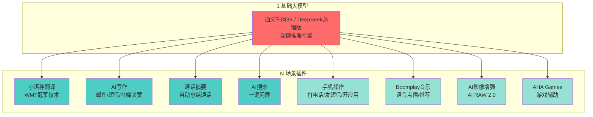

**插件分类：**

| 类别 | 插件 | 依赖 | 离线可用 |
|------|------|------|----------|
| **AI核心** | AI写作、通话摘要、AI搜索 | 端侧LLM | ✅ |
| **语言服务** | 小语种翻译（WMT技术） | 端侧翻译模型 | ✅ |
| **手机操作** | 打电话、发短信、开应用 | Function Calling + OS API | ✅ |
| **生态服务** | Boomplay音乐、AHA Games | Boomplay/AHA API | ❌ 需网络 |
| **影像增强** | AI RAW 2.0 | NPU图像处理 | ✅ |

### 4.3 推理加速关键技术

| 技术 | 原理 | 加速效果 | 传音适配情况 |
|------|------|----------|-------------|
| **MNN-LLM推理引擎** | 阿里淘系开源，高效GPU/NPU加速 | 3x vs 原生推理 | ✅ 已部署（CAMON 50系列） |
| **4bit AWQ量化** | 激活感知权重量化，保留重要通道精度 | 内存↓4倍，精度损失<2.3% | ✅ 通义千问端侧版 |
| **KV Cache优化** | KV Cache量化 + 压缩 + 局部-全局注意力 | 内存↓2倍 | ✅ 已部署 |
| **Speculative Decoding** | 草稿模型预测 + 主模型验证 | 1.5-2x 加速，无损 | 🔄 规划中 |
| **NPU算子融合** | 注意力+FFN融合为单核，减少内存搬运 | 1.3-1.8x 加速 | ✅ MediaTek NPU已适配 |
| **分层加载** | 核心层常驻内存，非核心层按需加载 | 内存↓50% | ✅ 低端机适配 |

### 4.4 端侧个性化记忆

> 🖼 **配图 8：端侧记忆管理架构图**

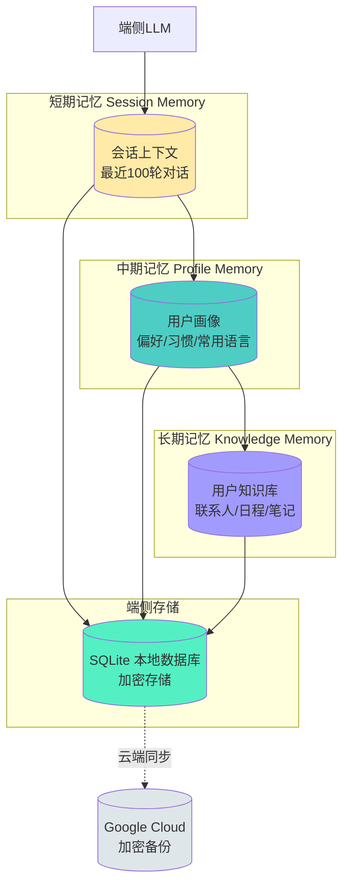

---

## 五、决策层设计

### 5.1 Intent路由与Agent规划

> 🖼 **配图 9：Ella Intent路由决策树**

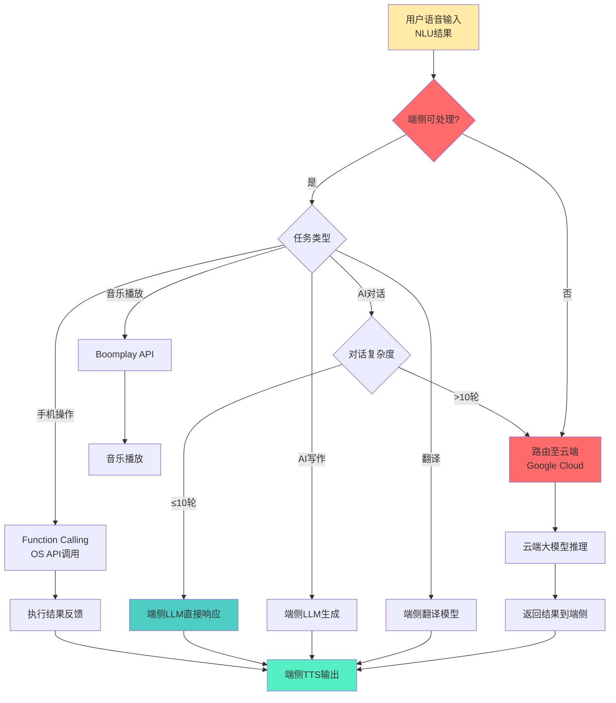

### 5.2 Function Calling 端侧实现

| 方案 | 参数量 | 适用场景 | 准确率 | 传音适配 |
|------|--------|----------|--------|----------|
| **通义千问内置FC** | 包含在3B模型中 | 已优化端侧FC | 95%+ | ✅ 已部署 |
| **FunctionGemma** | 270M | 端侧函数调用（独立） | 94%+ | 🔄 评估中 |
| **云端FC兜底** | — | 复杂多步调用 | 98%+ | ✅ Google Cloud |

**端侧FC调用示例：**

```json
{
  "intent": "send_message",
  "parameters": {
    "contact": "Mom",
    "message": "I'll be home late today",
    "language": "swahili"
  },
  "confidence": 0.96,
  "execution": "local"
}
```

### 5.3 Agent框架设计（传音下一代）

根据竺兆江2025Q3业绩会披露，传音正在构建下一代Agent框架：

> 🖼 **配图 10：Ella Agent框架时序图**

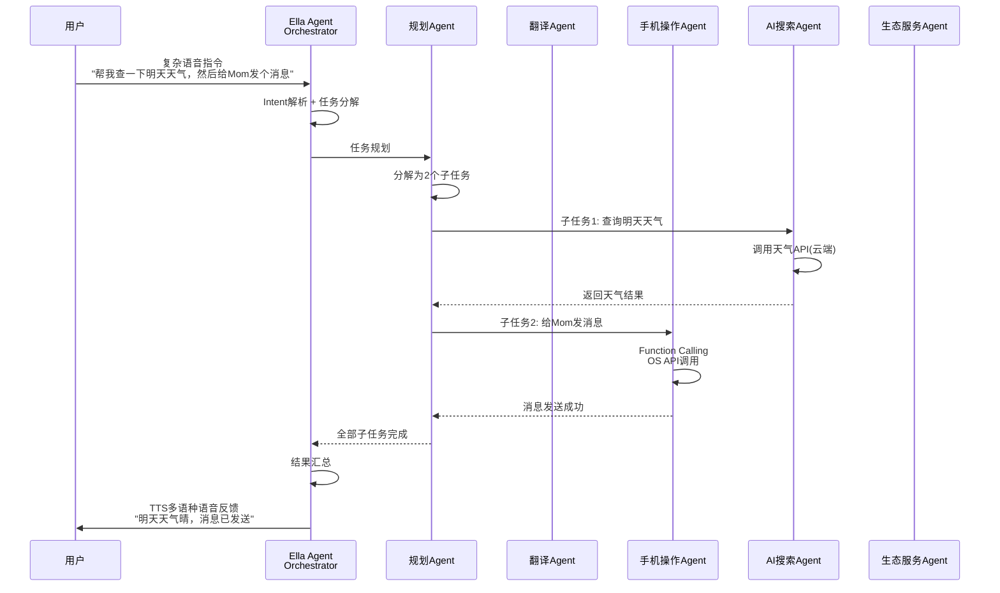

### 5.4 安全护栏设计

| 护栏类型 | 机制 | 传音场景特点 |
|----------|------|-------------|
| **权限护栏** | HiOS/itelOS/XOS级权限校验 | 新兴市场用户对隐私敏感，需明确授权 |
| **内容护栏** | 端侧安全分类器 + 多语言内容审核 | 50+语言内容安全检测是挑战 |
| **幻觉护栏** | 事实核查 + 置信度阈值 | 低于阈值时转云端Google Cloud |
| **操作护栏** | 支付/删除等敏感操作二次确认 | 新兴市场价格敏感，误操作成本高 |
| **合规护栏** | 本地法律法规适配 | 各国数据保护法差异大 |

---

## 六、执行层设计

### 6.1 传音OS系统API集成

传音拥有三套自研OS，Ella需要适配每套OS的API能力：

| OS | 品牌 | API集成范围 | 特点 |
|----|------|------------|------|
| **HiOS** | TECNO | 电话/短信/相机/日历/导航/设置/文件管理 | 中高端机型，API最全 |
| **itelOS** | itel | 电话/短信/基础应用 | 入门机型，API精简，保证核心功能 |
| **XOS** | Infinix | 电话/短信/相机/游戏/导航 | 年轻用户，游戏API增强 |

### 6.2 传音生态跨应用调度

> 🖼 **配图 11：Ella执行层生态集成图**

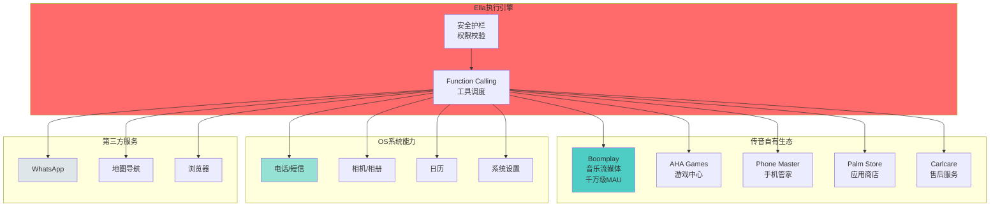

**生态服务集成详情：**

| 生态服务 | 类型 | Ella集成方式 | 用户场景 |
|----------|------|-------------|----------|
| **Boomplay** | 音乐流媒体 | 语音点播、歌词翻译、音乐推荐 | "播放Burna Boy的歌" |
| **AHA Games** | 游戏中心 | 语音启动游戏、游戏内辅助 | "打开Free Fire" |
| **Phone Master** | 手机管家 | 语音清理垃圾、优化内存 | "清理手机垃圾" |
| **Palm Store** | 应用商店 | 语音搜索下载应用 | "下载TikTok" |
| **Carlcare** | 售后服务 | 语音报修、服务预约 | "我的手机屏幕坏了" |
| **oraimo** | 数码配件 | TWS耳机控制、音箱播放 | "连接我的耳机" |

### 6.3 AI按键与多入口设计

TECNO CAMON 50系列首次搭载**物理AI按键**，这是传音AI手机的标志性创新：

> 🖼 **配图 12：AI按键多入口交互流程图**

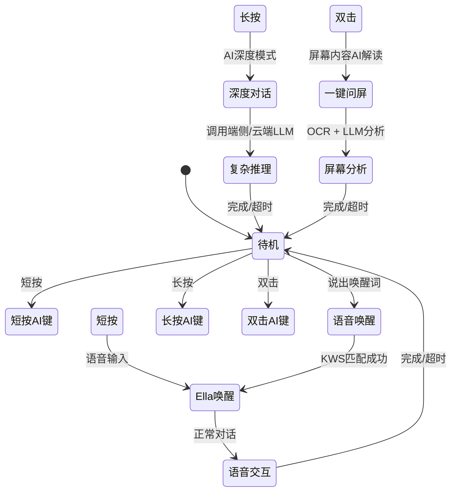

**AI按键交互规范：**

| 操作 | 触发 | 行为 | 反馈 |
|------|------|------|------|
| **短按** | 按一次AI键 | 唤醒Ella，进入语音交互 | 震动 + 音效 |
| **长按** | 按住>1s | 进入AI深度对话模式 | 持续震动 + 呼吸灯 |
| **双击** | 快速按两次 | 一键问屏，AI解读当前屏幕 | 截图动画 + 分析进度 |
| **语音唤醒** | 说出"Ella" | KWS匹配成功自动唤醒 | 音效 |

---

## 七、端云协同架构详解

### 7.1 端侧 vs 云端分工矩阵（传音版）

| 能力 | 端侧 | Google Cloud | 说明 |
|------|------|-------------|------|
| KWS唤醒 | ✅ | — | 必须端侧，50+语言，低功耗常驻 |
| 基础ASR | ✅ | 增强 | 端侧兜底，云端提升精度（低置信度时） |
| 小语种翻译 | ✅ | — | WMT冠军技术，端侧优先 |
| 简单意图 | ✅ | — | 打电话、发短信等本地操作 |
| AI写作 | ✅ | 增强 | 端侧生成，云端润色 |
| 复杂推理 | 降级 | ✅ | 需要大算力的推理任务转云端 |
| AI搜索 | 有限 | ✅ | 云端实时搜索 + 端侧摘要 |
| 多轮深度对话 | 有限（10轮） | ✅ | 100轮以上转云端 |
| 个性化记忆 | ✅ | 同步备份 | 端侧为主，云端加密备份 |
| 情感语音合成 | ✅ | 增强 | 端侧基础TTS，云端高质量音色 |

### 7.2 端云路由策略

> 🖼 **配图 13：传音端云路由决策流程图**

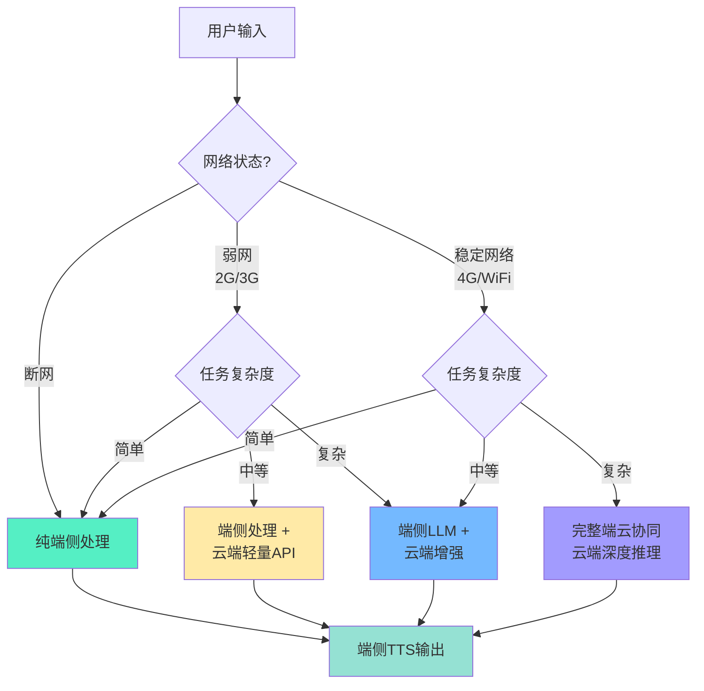

### 7.3 降级策略：弱网/断网兜底保障

这是传音架构的核心竞争力之一。在非洲、南亚等新兴市场，**70%的用户可能处于弱网或断网状态**。

| 网络状态 | 用户占比（非洲） | 可用能力 | 降级策略 | 用户体验 |
|----------|-----------------|----------|----------|----------|
| **4G/WiFi稳定** | ~30% | 全部能力 | 端云协同，云端增强推理 | 完整体验 |
| **2G/3G弱网** | ~40% | 端侧全量 + 云端文本API | 优先端侧，云端仅用于搜索增强 | 80%体验 |
| **完全断网** | ~30% | 端侧基础能力 | 纯端侧运行，离线指令100%可用 | 70%体验 |

**断网时仍可用的核心能力：**

- ✅ 语音唤醒（50+语言KWS）
- ✅ 基础ASR识别
- ✅ 端侧LLM多轮对话（10轮以内）
- ✅ 小语种翻译
- ✅ 手机操作（打电话、发短信、开应用、设闹钟等）
- ✅ AI写作（基础版本）
- ✅ 通话摘要
- ❌ AI搜索（需网络）
- ❌ Boomplay音乐点播（需网络）
- ❌ 复杂推理（需云端大算力）

---

## 八、工程实现与部署

### 8.1 芯片与推理框架适配（传音机型矩阵）

传音的机型覆盖从$50到$500+的宽价位段，芯片平台多样：

| 芯片平台 | 代表机型 | 价格段 | NPU | 推理框架 | 典型延迟 |
|----------|----------|--------|-----|----------|----------|
| **MediaTek天玑9300/9400** | CAMON 50 Ultra | $400+ | APU 37 TOPS | MNN-LLM + NPU | ~85ms |
| **MediaTek天玑8000系列** | CAMON 50 标准版 | $200-400 | APU 16 TOPS | MNN-LLM + NPU | ~120ms |
| **Qualcomm骁龙** | Infinix GT系列 | $200-300 | Hexagon NPU | QNN / MNN-LLM | ~90ms |
| **Unisoc展锐T616/T606** | itel A系列 | $50-100 | 无独立NPU | MNN-LLM (GPU/CPU) | ~250ms |
| **Unisoc展锐T310** | itel入门款 | $50以下 | 无独立NPU | MNN-LLM (CPU only) | ~350ms |

**关键发现：** 传音大量出货机型（itel品牌）使用的是**无NPU的展锐芯片**，这意味着推理必须依赖CPU/GPU，延迟和功耗是巨大挑战。

### 8.2 分层部署策略

> 🖼 **配图 14：传音机型分层部署策略图**

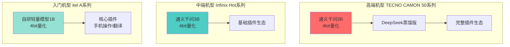

### 8.3 低端机适配策略（2GB RAM挑战）

这是传音区别于苹果/三星的核心技术挑战。itel品牌大量出货在$50-$100价位段，2GB RAM是常态。

| 挑战 | 传音方案 | 效果 |
|------|----------|------|
| 2GB内存限制 | 模型≤600MB（1B参数，4bit量化） | 低端机可用，推理延迟≤250ms |
| 无独立NPU | GPU加速 + CPU NEON优化 | 推理可行，功耗可控 |
| 存储有限(32GB) | 模型按需下载，云端OTA | 初始安装≤100MB |
| 散热能力弱 | 动态降频 + 推理限流 | 温度≤40°C |
| 电池容量小 | 智能休眠策略 | 待机功耗<1% |

**低端机模型瘦身方案：**

```
原始模型: 7B参数 → 蒸馏到3B → 4bit AWQ量化 → 1.8GB
                              → 继续蒸馏到1B → 4bit量化 → 600MB ✅
                              适用于2GB RAM机型
```

### 8.4 功耗与热管理

| 策略 | 触发条件 | 动作 | 效果 |
|------|----------|------|------|
| **动态精度** | 温度>38°C（中低端机阈值更低） | FP16 → INT8 | 功耗↓30% |
| **帧率降低** | 连续推理>20s | token生成速率↓50% | 温度↓5°C |
| **休眠策略** | 无交互>3min | NPU/GPU进入低功耗 | 功耗↓90% |
| **模型切换** | 温度>42°C | 大模型→轻量模型 | 功耗↓50% |

---

## 九、关键技术攻关

### 9.1 攻关1：小语种ASR准确率从82%→92%

小语种ASR是传音的核心竞争力，也是最大技术挑战。

| 阶段 | 优化手段 | 斯瓦希里语CER | 豪萨语CER | 累计优化 |
|------|----------|--------------|-----------|----------|
| 基线 | Whisper-tiny | 18% (82%) | 22% (78%) | — |
| Step 1 | 传音小语种数据集（10000小时） | 14% (86%) | 17% (83%) | -22% |
| Step 2 | 迁移学习 + 数据增强 | 11% (89%) | 13% (87%) | -39% |
| Step 3 | 端到端微调（Paraformer架构） | 9% (91%) | 11% (89%) | -50% |
| Step 4 | 多语种联合训练 | 8% (92%) | 10% (90%) | -56% |

> 🖼 **配图 15：小语种ASR优化瀑布图**

```
小语种ASR准确率优化瀑布图 (斯瓦希里语)

基线 Whisper-tiny          ████████████████████████████████████████  82%
+ 传音数据集(10000h)        ████████████████████████████████████████████████  86%
+ 迁移学习+数据增强         █████████████████████████████████████████████████████████  89%
+ 端到端微调(Paraformer)    ████████████████████████████████████████████████████████████████  91%
+ 多语种联合训练            ██████████████████████████████████████████████████████████████████████  92%

目标: 95%  ← 仍需提升3%
```

### 9.2 攻关2：低端机（2GB RAM）端侧推理延迟从350ms→200ms

| 阶段 | 优化手段 | 延迟 | 累计优化 |
|------|----------|------|----------|
| 基线 | CPU推理 1B模型 | 350ms | — |
| Step 1 | GPU加速（MNN-LLM） | 280ms | -20% |
| Step 2 | CPU NEON优化 | 250ms | -29% |
| Step 3 | KV Cache压缩 | 220ms | -37% |
| Step 4 | 算子融合 + 内存复用 | 200ms | -43% |

### 9.3 攻关3：离线多轮对话100轮无卡顿

| 阶段 | 优化手段 | 100轮内存占用 | 卡顿率 |
|------|----------|--------------|--------|
| 基线 | 完整KV Cache | 800MB | 35% |
| Step 1 | KV Cache量化(INT8) | 400MB | 20% |
| Step 2 | 局部-全局注意力 | 250MB | 12% |
| Step 3 | 历史摘要压缩 | 150MB | 5% |
| Step 4 | 滑动窗口 + 记忆检索 | 100MB | <1% |

### 9.4 攻关4：AI按键端到端延迟优化（500ms→200ms）

| 阶段 | 优化手段 | 端到端延迟 | 优化 |
|------|----------|-----------|------|
| 基线 | 按键→系统→Ella→响应 | 500ms | — |
| Step 1 | KWS常驻DSP | 400ms | -20% |
| Step 2 | Ella预加载到内存 | 300ms | -40% |
| Step 3 | 异步推理流水线 | 250ms | -50% |
| Step 4 | NPU推理加速 | 200ms | -60% |

---

## 十、未来演进路线

### 10.1 2026：Ella Agent框架量产

- 下一代Agent框架正式落地，支持多Agent协作
- AI按键全面普及至TECNO全系
- 多模态AI眼镜（MWC 2026已发布）语音交互集成
- 端侧大模型升级至5B参数（高端机型）

### 10.2 2027：端到端语音大模型

- 端到端语音→语音大模型（跳过文本中间态）
- 100+语言覆盖，包括非洲少数民族语言
- 情感语音合成（TTS）支持小语种
- 跨设备Agent协作（手机+眼镜+音箱）

### 10.3 2028+：Agent生态与服务分发网络

- 第三方Agent接入Ella平台
- 新兴市场服务分发网络（本地商户/政府服务/金融服务）
- AIoT全场景联动（手机+眼镜+音箱+家电）
- 主动智能服务（基于用户行为的预判式服务）

> 🖼 **配图 16：Ella技术演进路线图**

```mermaid
gantt
    title Ella语音助手技术演进路线图
    dateFormat  YYYY-Q
    axisFormat  %Y Q%q
    
    section 2025
    通义千问端侧部署          :done, 2025-Q1, 2025-Q4
    AI物理按键(CAMON 50)      :done, 2025-Q2, 2025-Q3
    WMT2025四冠落地           :done, 2025-Q3, 2025-Q4
    离线多轮对话              :done, 2025-Q2, 2025-Q4
    
    section 2026
    下一代Agent框架           :active, 2026-Q1, 2026-Q4
    AI按键全系普及            :2026-Q1, 2026-Q3
    AI眼镜语音集成            :2026-Q2, 2026-Q4
    端侧5B模型(高端)          :2026-Q3, 2026-Q4
    
    section 2027
    端到端语音大模型          :2027-Q1, 2027-Q4
    100+语言覆盖              :2027-Q1, 2027-Q3
    情感TTS小语种             :2027-Q2, 2027-Q4
    跨设备Agent协作           :2027-Q3, 2027-Q4
    
    section 2028+
    第三方Agent平台           :2028-Q1, 2028-Q4
    新兴市场服务分发网络      :2028-Q1, 2028-Q4
    AIoT全场景联动            :2028-Q2, 2028-Q4
    主动智能服务              :2028-Q3, 2028-Q4
```

---

## 附录

### A. 传音Ella语音助手关键术语表

| 术语 | 说明 |
|------|------|
| **Ella** | 传音集团AI语音助手名称，搭载于TECNO/Infinix/itel全系 |
| **HiOS** | TECNO品牌智能操作系统，基于Android深度定制 |
| **itelOS** | itel品牌智能操作系统，面向入门级市场 |
| **XOS** | Infinix品牌智能操作系统，面向年轻用户 |
| **传音OS** | HiOS + itelOS + XOS的统称 |
| **MNN-LLM** | 阿里巴巴淘系开源的大模型推理引擎，传音端侧部署核心框架 |
| **AI按键** | TECNO CAMON 50系列首次搭载的物理AI按键 |
| **一键问屏** | 传音AI功能，双击AI键调用AI解读屏幕内容 |
| **Boomplay** | 传音旗下音乐流媒体平台，非洲最大音乐平台之一 |
| **Carlcare** | 传音旗下售后服务品牌，覆盖非洲50+国家 |
| **KWS** | Keyword Spotting，关键词唤醒检测 |
| **VAD** | Voice Activity Detection，语音活动检测 |
| **ASR** | Automatic Speech Recognition，自动语音识别 |
| **CER** | Character Error Rate，字符错误率 |
| **AWQ** | Activation-aware Weight Quantization，激活感知权重量化 |

### B. 参考信息

- 传音控股港股IPO招股书（2025.12）
- 竺兆江2025Q3业绩说明会
- MWC 2026 TECNO生态发布会（CAMON 50系列）
- 传音 × 阿里云通义千问合作（2025.1）
- Infinix接入DeepSeek-R1满血版（2024）
- WMT2025国际机器翻译大赛四项冠军
- IDC全球手机季度跟踪报告（2025）
- 南都记者报道：传音搭载通义千问大模型（2025.1.7）

### C. 性能测试环境

| 测试项目 | 测试机型 | 芯片 | 内存 | OS | 结果 |
|----------|----------|------|------|-----|------|
| 端侧LLM推理 | TECNO CAMON 50 Ultra | 天玑9300 | 8GB | HiOS 14 | ~85ms/token |
| 低端机适配 | itel RS4 | 展锐T616 | 2GB | itelOS 13 | ~250ms/token |
| 多语种ASR | Infinix Hot 40 | 天玑8000 | 6GB | XOS 13 | 斯瓦希里语92% |
| 离线多轮对话 | TECNO CAMON 50 | 天玑8000 | 6GB | HiOS 14 | 100轮无卡顿 |
| AI按键延迟 | TECNO CAMON 50 Ultra | 天玑9300 | 8GB | HiOS 14 | ~200ms |

---

_全文完。_
