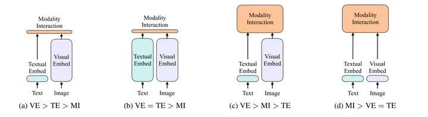

<!-- more -->

## 目录
<!-- toc -->

# Stage1: 模块独立[2]


### model
+ CLIP
+ ViLT
+ ALBEF

#  Stage2: 模块共享[2]

### model
+ VLMO
+ BLIP
+ BLIP2
+ BEiTv3

# Stage3: 范式统一[2]
### model
+ Unified-IO
+ Uni-Perceiver
+ PaLi

# 总结 [1]


# 参考
### Overview
1. [多模态大模型 CLIP, BLIP, BLIP2, LLaVA, miniGPT4, InstructBLIP 系列解读](https://zhuanlan.zhihu.com/p/653902791) ***

2. [[Transformer 101系列] 多模态的大一统之路](https://zhuanlan.zhihu.com/p/643969218)  *** 

1xx. [多模态论文串讲](https://blog.csdn.net/qq_52038588/article/details/133893013) ***
   [多模态论文串讲：ALBEF & VLMo & BLIP & CoCa & Beit V3](https://blog.csdn.net/qq_40168949/article/details/130374733)

1xx. [图生文多模态大模型开源项目回顾：兼看20240307大模型进展早报](https://mp.weixin.qq.com/s?__biz=MzAxMjc3MjkyMg==&mid=2648409338&idx=1&sn=5445ff1e9bedc561393b6da63fdf71f9)

1xx. [图文多模态大模型综述](https://zhuanlan.zhihu.com/p/662889725)

1xx. [Multimodality and Large Multimodal Models (LMMs)](https://huyenchip.com/2023/10/10/multimodal.html)
   [多模态和多模态大模型 (LMM)[译]](https://baoyu.io/translations/lmm/multimodality-and-large-multimodal-models)  CLIP Flamingo

1xx. [写在多模态征服一切之前（未来数据和模型应该是什么样的？）](https://zhuanlan.zhihu.com/p/667942680)
