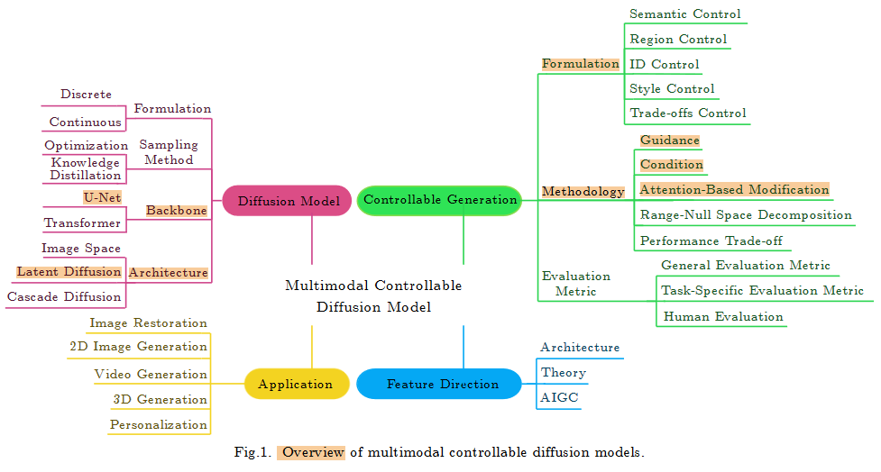
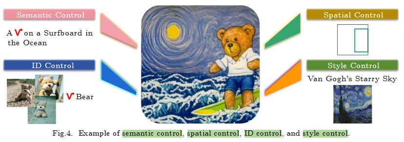

# 论文
- 论文地址
[A Survey of Multimodal Controllable Diffusion Models](http://doi.org/10.1007/s11390-024-3814-0)

# Overview

# Formulation

### Semantic Control
text-to-image[79, 82–84]

**T2I-Adapter[84]**

### Spatial Control
- Layout- or segmentation-guided approaches[83, 87–91]
- Sketch- or edge-guided approaches[22, 84, 92–96]
  **ControlNet[22]**    **T2I-Adapter[84]**

- Depth-guided approaches[22, 84, 94–97]
  **ControlNet[22]**    **T2I-Adapter[84]**

- Skeleton-guided approaches[22, 27, 84, 93, 95, 96]
  **ControlNet[22]**    **T2I-Adapter[84]**

### ID Control
Paint by example[104]  edit

### Style Control
**Textual Inversion[111], Dreambooth[112], or LoRA[113]**

### Controllability Trade-Off

# Methodologies
### Guidance

- Controlnet
- **classifier-guidance**

### Condition

- GLIDE
- **classifier-free guidance (CFG)**

### Attention-Based Modification【cross-attention】

- **Prompt-to-prompt**
- **Zero-shot image-to-image translation**

