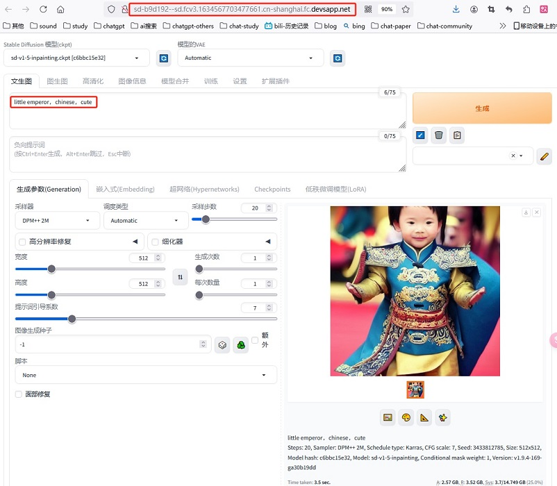
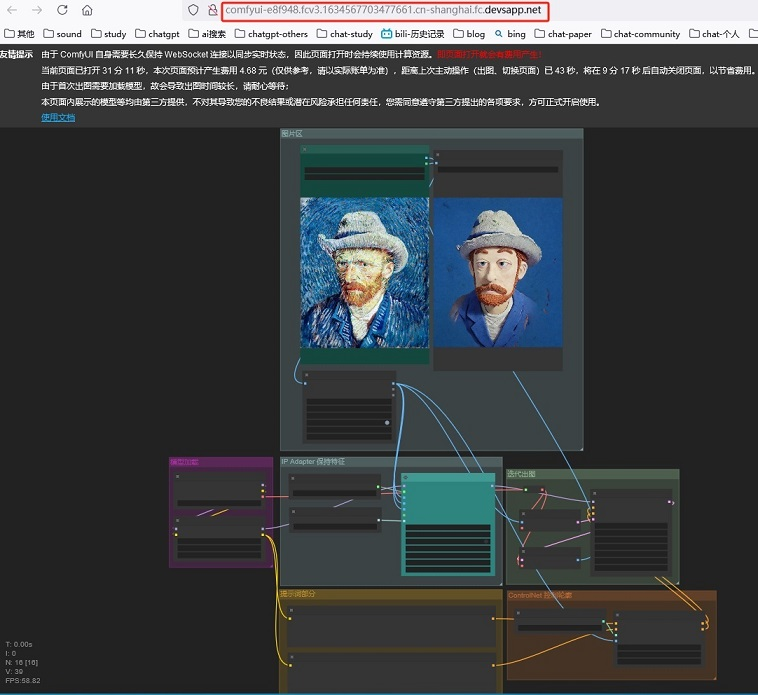

# API-based
### diffusion-models-class [官方课程]
+ [Unit 1: An Introduction to Diffusion Models](https://candied-skunk-1ca.notion.site/Unit-1-An-Introduction-to-Diffusion-Models-f0ee4c8bc4914ef8961b48241064b2b7?pvs=4)
+ [Unit 2: Fine-Tuning, Guidance and Conditioning](https://candied-skunk-1ca.notion.site/Unit-2-Fine-Tuning-Guidance-and-Conditioning-27180b80a58e4bd2860019c4237a8532?pvs=4)
+ [Unit 3: Stable Diffusion](https://candied-skunk-1ca.notion.site/Unit-3-Stable-Diffusion-a8770ac5b0214c2f9cfce878812b5bf8?pvs=4)
+ [Unit 4: Going Further with Diffusion Models](https://candied-skunk-1ca.notion.site/Unit-4-Going-Further-with-Diffusion-Models-e997fe47d4e64069bba59ac81b7a4718?pvs=4)

### diffusers 重点pipeline [10]
  - controlnet 【controllable】
  - dreambooth 【fine tuning】
  - instruct_pix2pix 【image edit】

# UI-based
### stable-diffusion-webui
+ stable-diffusion-webui-colab[11]
  没试过，colab要充值

+ stable-diffusion-webui   on   阿里serverless [12]  

  

### comfyui
+ ComfyUI  on  阿里serverless[13]

  

# 参考
###  API-based
10. [Repo diffusers](https://github.com/huggingface/diffusers/tree/main/examples) git

### UI-based
11.  [可白嫖且很香—轻轻松松在colab上部署Stable Diffusion大模型！](https://www.bilibili.com/video/BV1QS421A7zF/) V
      [stable-diffusion-webui-colab Repo](https://github.com/camenduru/stable-diffusion-webui-colab) git
      [Install the WebUI Colab to Google Drive ](https://github.com/camenduru/stable-diffusion-webui-colab/tree/drive) git 运行这3个脚本

12. [超详细云端部署Stable Diffusion教程！](https://www.bilibili.com/video/BV19u411x7Bk/) V
    【用FC的应用模版部署】【3个月免费的serverless+NAS】
    
13. [函数计算 ComfyUI 使用文档](https://alidocs.dingtalk.com/i/p/x9JOGOjr65om4QLAy0mVPNbMnOEE8z89)  
    用 ComfyUI 自制“粘土滤镜
    【用FC的应用模版部署】【3个月免费的serverless+NAS】
