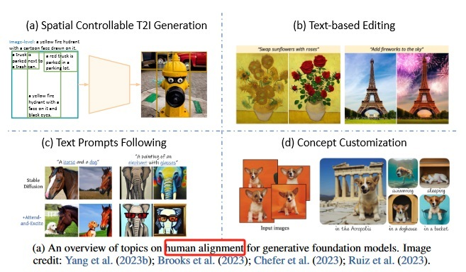

<!-- more -->

## 目录
<!-- toc -->

# 论文
+ 论文地址
 《Multimodal Foundation Models:From Specialists to General-Purpose Assistants》 .Sep 2023   - microsoft

+ 开源地址
  [Computer Vision in the Wild (CVinW)](https://github.com/Computer-Vision-in-the-Wild/CVinW_Readings) 

# overview [0]


# 视觉理解 [1]





# 视觉生成 [1]
## Human Alignments in Visual Generation  [10]
四种alignment的方式
### spatial controllable T2I generation

-  **结合位置分布的文字描述**（比较麻烦的用户交互，不仅需要文字，而且需要位置），常用于**对位置要求比较高的创意设计（海报等）**

   - 直接讲原来clip那种image-level的text description升级为基于区域的text description

     - **reco**
     - gligen

   - 将box描述变为spatial condition

     - **controlnet**  

   - 无需fintinue，直接变为inference-guide

     - universal guidance for diffusion model

###  text-based editing

-  **给一张图和对应的修改文字，输出要求的图**，常用于ps等产品

   - diffusion process manipulations

     - **promot2promot**

   - text instruction editing

     - **InstructPix2Pix** 

   - Editing with external pre-trained models

### text promots following 

- **直接给文字描述，生成对应的图**，这个是**目前常见文生图产品的交互方式**，常用于c端或者b端用户图像内容生成。但其对**更细节的控制存在一定的难度**
  - Inference-time manipulation
  - StructureDiffusion
  - **Attend-and-Excite**
  - Model tuning to follow text prompt
  - ddpo

### concept customization

- 给一张图，提取图片中的关键内容，做**各种风格（背景/动作）变换**，更用于**不那么精细的广义产品**，比2的运用范围更加广义

  - Concept Customization

    - **Textual Inversion**
    - **[DreamBooth]**
  - Multi-concept customization

    - Custom Diffusion

  - Customization without test-time finetuning

    - SuTI





## Text-to-Image Generation  技术流派（4类）
+ Generative adversarial networks (GAN)
+ Variational autoencoder (VAE)
+ Discrete image token prediction
+ **Diffusion model**

# 统一的视觉模型[2]

# 端到端的方式训练LLM[2]

# 多模态 Agent[3]

# 参考
### 翻译
《Multimodal Foundation Models:From Specialists to General-Purpose Assistants》  

0. [AGI之MFM：《Multimodal Foundation Models: From Specialists to General-Purpose Assistants多模态基础模型：从专家到通用助](https://blog.csdn.net/qq_41185868/article/details/133594461) 翻译
   
1. [AGI之MFM：《多模态基础模型：从专家到通用助手》翻译与解读之视觉理解、视觉生成](https://yunyaniu.blog.csdn.net/article/details/133594554)
   
2. [AGI之MFM：《多模态基础模型：从专家到通用助手》翻译与解读之统一的视觉模型、加持LLMs的大型多模态模型](https://yunyaniu.blog.csdn.net/article/details/133594624)
   
3. [AGI之MFM：《多模态基础模型：从专家到通用助手》翻译与解读之与LLM协同工作的多模态智能体、结论和研究趋势](https://yunyaniu.blog.csdn.net/article/details/133606408)

### 解读
10. [大模型系列04 -文本图像生成](https://zhuanlan.zhihu.com/p/669757416)

1xx.   [Multimodal Foundation Models: From Specialists to General-Purpose Assistants](https://blog.csdn.net/qq_41200212/article/details/134663233)  

1xx.  对应第二章节 
  [《Alignments in Text-to-Image Generation》](https://datarelease.blob.core.windows.net/tutorial/vision_foundation_models_2023/slides/Zhengyuan_Tutorial_T2I2023.pdf)
   [[CVPR2023 Tutorial Talk] Alignments in Text-to-Image Generation](https://www.bilibili.com/video/BV14P411v7Un/) V

1xx. 对应第三章节 
[《From Specialist to Generalist:
Towards General Vision Understanding Interface》](https://datarelease.blob.core.windows.net/tutorial/vision_foundation_models_2023/slides/Jianwei_CVPR2023_Tutorial.pdf)
  [[CVPR Tutorial Talk] Towards General Vision Understanding Interface](https://www.bilibili.com/video/BV1ds4y1k7pj/?vd_source=f6e8c1128f9f264c5ab8d9411a644036)   