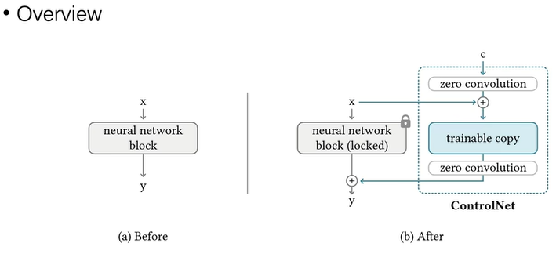
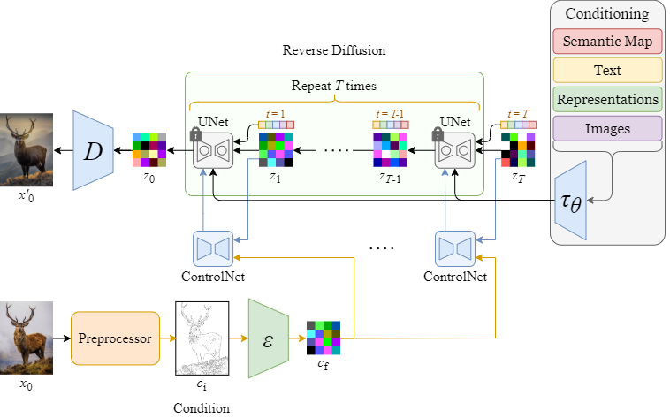
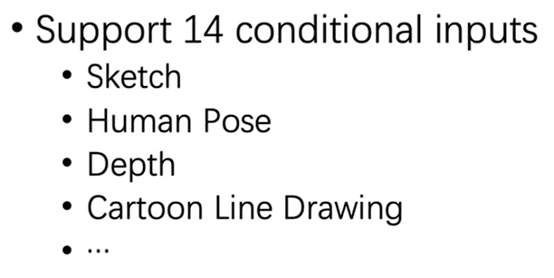

# 论文[ControlNet]

- 论文地址
[Adding Conditional Control to Text-to-Image Diffusion Models](https://arxiv.org/abs/2302.05543)
- 开源地址
[ControlNet](https://github.com/lllyasviel/ControlNet) git

# ControlNet[10]

ControlNet is a type of model for controlling image diffusion models by 
conditioning the model with an additional input image. There are many 
types of conditioning inputs (canny edge, user sketching, human pose, 
depth, and more) you can use to control a diffusion model. This is 
hugely useful because it affords you greater control over image 
generation, making it easier to generate specific images without 
experimenting with different text prompts or denoising values as much.

ControlNet是一种模型，用于通过使用额外的输入图像调节模型来控制图像扩散模型。您可以使用**多种类型的调节输入（精巧的边缘、用户草图、人体姿势、深度等）**来控制扩散模型。这非常有用，因为它为您提供了对图像生成的更大控制，从而可以更轻松地生成特定图像，而无需尝试使用不同的文本提示或对值进行过多的去噪。

# Method [2][3]

ControlNet 采用了一种类似微调的方法，如下图，在原模型的基础上，增加一个**可训练副本**，可训练副本的输入是原输入x加上条件c，然后把两个模型的输出相加，可训练副本的**输入输出都经过零卷积(zero convolution)处理**，用于在刚开始训练时**保持模型的稳定性**。



具体的针对 Stable Diffusion 的 ControlNet 结构如下图，只复制了 UNet 的 **Encoder blocks 和 Middle block (结构+权重)**，控制条件图c先经过几层卷积，再**与原UNet的输入zt相加作为输入**，**ControlNet 每个 block 的输出再 Add 到原 UNet 的 Decoder block 输入**，实际实现中，ControlNet 的输出还可以乘上一个scale，用于控制影响程度。注意这里 ControlNet 同样输入了和原 UNet 一样的 Prompt&Time



完整的 Diffusion + ControlNet 流程如下：



# Conditional Inputs[2]



# Comparison with T2I-Adapter[2]



### T2I-Adapter  vs. Controlnet

Complexity 更高【Conditional Input可以叠加到一起】

Flexibility 更高 【每种输入有一种Adaptor，多种Adaptor可以配合使用】

# 参考

1.  [【AI论文精读】【图像生成】全网最详细controlnet论文逐段精读](https://www.bilibili.com/video/BV1fs4y177nu/) V
2. [【2023 ControlNet】斯坦福最新的可控文本生成图像扩散模型](https://www.bilibili.com/video/BV13x4y1w7k1/) V
3. [ControlNet 算法原理与代码解释](https://robot9.me/controlnet-diffusers/) ***  优化，代码

1xx. [深入浅出完整解析ControlNet核心基础知识](https://zhuanlan.zhihu.com/p/660924126) ***

[不得不读 | 深入浅出ControlNet，一种基于生成扩散模型Stable Diffusion、可控生成的AIGC绘画生成算法！](https://zhuanlan.zhihu.com/p/617017935)

### 实践

10.  [ControlNet](https://huggingface.co/docs/diffusers/main/en/using-diffusers/controlnet)  Hugggingface
11.  [control net](https://www.bilibili.com/video/BV1Go4y1M7cK?p=2) V

