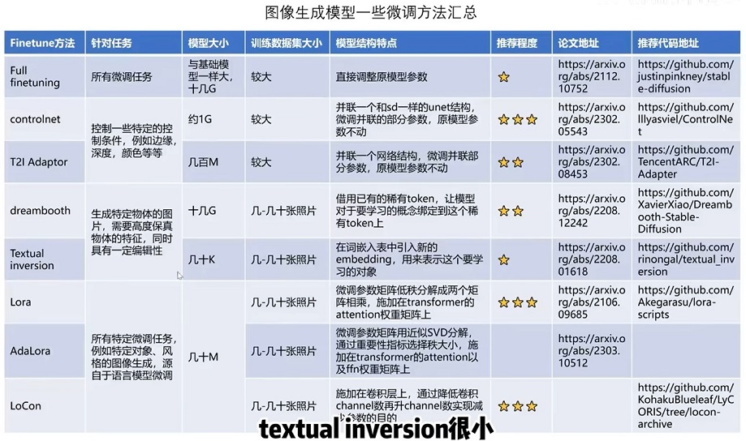
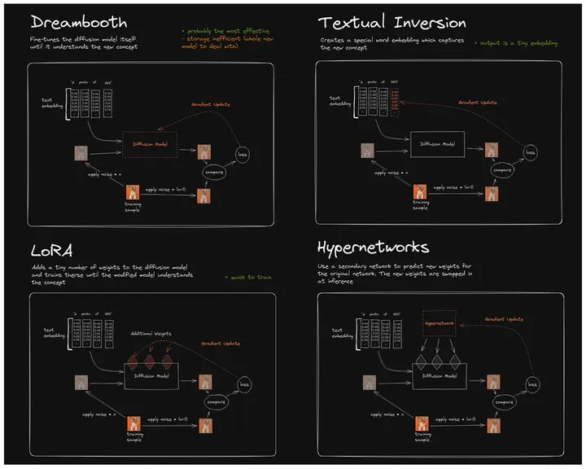

<!-- more -->

# 对比总结[1]

| 训练方法 | 方法 | 局限性 |
| --- | --- | --- |
| Text Inversion | 使用提供的一组图片**训练一个新单词的Embedding** ，并将其与词汇表中的已有单词关联起来，这个新单词即为这组图片概念的指代。 | 训练过程只对应 Embedding，扩散模型没有新知识输入，所以也无法产生新的内容。 |
| Full FineTune | **最朴素**的方式，使用图片+ 标注的数据集，进行迭代训练，数据集标注可以选择BLIP来生成。训练直接对原模型的所有权重进行调整。 | 容易过拟合，导致生成图片的多样性不够，结果难以控制。模型体积大，不便于传播。 |
| Dreambooth | 提供代表某个新概念（instance） 对应的一组图像，并使用**罕见字符（identifier）** 进行概念Mapping，训练过程充分考虑**原有相关主题（class）生成**，避免过拟合。训练直接对**原模型的所有权重进行调整**。 | 训练过程只针对新概念 （instance），**多样性差**。如果需要多概念生成，需要多次训练。模型体积大，不便于传播。 |
| LoRA（w Dreambooth） | 冻结预训练模型参数，在每个Transformer块插入**可训练层**，不需要完整调整 UNet 模型的全部参数。**训练结果只保留新增的网络层，模型体积小**。 | **训练效果不如Dreambooth** |

# 对比总结[2]

# 对比总结[3]

# 参考

1. [Stable Diffusion 微调及推理优化](https://cloud.tencent.com/developer/article/2302436)
2. [【论文串读】Stable Diffusion模型微调方法串读](https://www.bilibili.com/video/BV19h4y1475y/) V
3. [Stable Diffusion——四种模型 LoRA（包括LyCORIS）、Embeddings、Dreambooth、Hypernetwork](https://zhuanlan.zhihu.com/p/669895990)

### 实战

1xx. [Text Inversion](https://www.bilibili.com/video/BV1184y1g7pG/?p=4) V
   【这个比较详细】
1xx. [lora Dreambooth](https://www.bilibili.com/video/BV1184y1g7pG?p=7) V
   【冻结不训练unet，只训练lora】
   【为unet模型添加注意力层，注意力层是要训练的参数】
   【大部分代码和Dreambooth差不多】

### 实战

1xx.  [+ concept customization](https://www.notion.so/concept-customization-067033e842b044729d81aed1d96608fd?pvs=21)     
    dreambooth lora + textual_inversion   diffusers

1xx. [手把手教你微调Stable Diffusion](https://juejin.cn/post/7282693176199987215)  *
    lora on DreamBooth