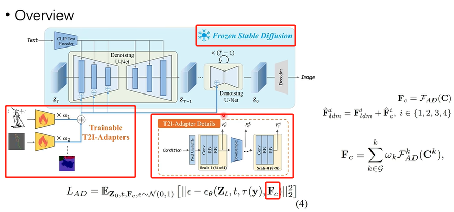

# 论文[T2I-Adapter]

- 论文地址
[T2I-Adapter](https://arxiv.org/pdf/2302.08453)
- 开源地址
[T2I-Adapter](https://github.com/TencentARC/T2I-Adapter) git

# **T2I-Adapter[10]**

[T2I-Adapter](https://hf.co/papers/2302.08453) is a lightweight adapter for controlling and providing more accurate
structure guidance for text-to-image models. It works by learning an alignment between the internal knowledge of the
text-to-image model and an external control signal, such as edge detection or depth estimation.

[T2I-Adapter](https://hf.co/papers/2302.08453) 是一种**轻量级**适配器，用于控制**文本到图像**模型并提供更准确的**结构指导**。它的工作原理是学习文本到图像模型的**内部知识与外部控制信号**（如边缘检测或深度估计）之间的**对齐**。

The T2I-Adapter design is simple, the condition is passed to four feature extraction blocks and three downsample blocks. This makes it fast and easy to train different adapters for different conditions which can be plugged into the text-to-image model. T2I-Adapter is similar to [ControlNet](https://huggingface.co/docs/diffusers/main/en/using-diffusers/controlnet) except it is smaller (~77M parameters) and faster because it only runs once during the diffusion process. The downside is that performance may be slightly worse than ControlNet.

T2I-Adapter的设计很简单，条件被传递给四个特征提取模块和三个下采样模块。这使得针对不同条件训练不同的适配器变得快速而容易，这些适配器可以插入到文本到图像模型中。T2I-Adapter 类似于 [ControlNet](https://huggingface.co/docs/diffusers/main/en/using-diffusers/controlnet)，不同之处在于它更小（~77M 参数）和更快，因为它在扩散过程中只运行一次。**缺点是性能可能比 ControlNet 稍差**。

# Motivation[1]



# Method[1]



# 参考

1.[【北大-腾讯最新工作】T2I-Adapter 更加可控的文本生成图像](https://www.bilibili.com/video/BV1JT411U7iY/)  V

1xx. [T2I-Adapter：挖掘更多SD模型的控制能力](https://zhuanlan.zhihu.com/p/656091571)

1xx. [Efficient Controllable Generation for SDXL with T2I-Adapters](https://huggingface.co/blog/t2i-sdxl-adapters)

### 实践

10.  [T2I-Adapter](https://huggingface.co/docs/diffusers/main/en/using-diffusers/t2i_adapter)  hugggingface
