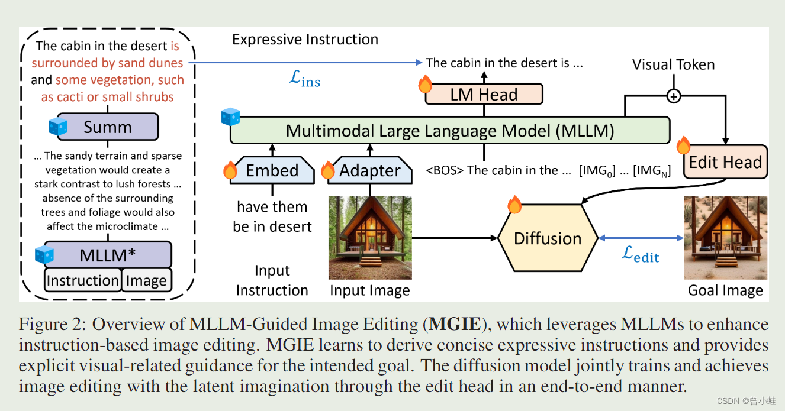

# 论文

- 论文地址
[MGIE](https://openreview.net/pdf?id=S1RKWSyZ2Y) 2024 Apple  
- 开源地址
[Repo](https://github.com/apple/ml-mgie) git  
[Repo](https://github.com/tsujuifu/pytorch_mgie) git  
- Project page
[Project page](https://mllm-ie.github.io/)  

# Method[1]

# 参考

1. [【多模态MLLMs+图像编辑】MGIE：苹果开源基于指令和大语言模型的图片编辑神器（24.02.03开源）](https://blog.csdn.net/imwaters/article/details/136045973)

1xx. [罕见！苹果开源图片编辑神器MGIE，要上iPhone?](https://mp.weixin.qq.com/s/c87cUuyz4bUgfW2_ma5xpA)