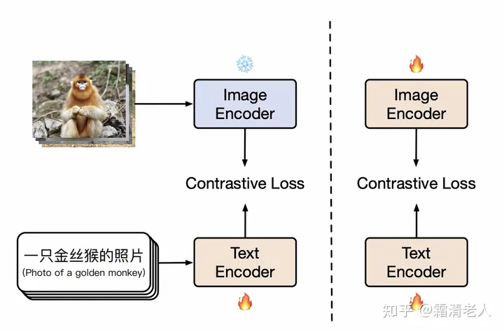

# CLIP Training [9]
```
# image_encoder - ResNet or Vision Transformer
# text_encoder - CBOW or Text Transformer
# I[n, h, w, c] - minibatch of aligned images
# T[n, l] - minibatch of aligned texts
# W_i[d_i, d_e] - learned proj of image to embed
# W_t[d_t, d_e] - learned proj of text to embed
# t - learned temperature parameter
# extract feature representations of each modality

# -------------------------------------------------
# 1、图像/文字数据过image/text encoder，提取单模态特征
# 每张图片对应一个基本特征I_i
# 每张文字对应一个基本特征T_i
# -------------------------------------------------
I_f = image_encoder(I) #[n, d_i]
T_f = text_encoder(T) #[n, d_t]

# -------------------------------------------------
# 2. 图像/文字的基本特征过多模态Embedding，提取多模态特征
# 同时对这两个多模态特征做Layer Norm
# -------------------------------------------------
I_e = l2_normalize(np.dot(I_f, W_i), axis=1) # [n, d_i] * [d_i, d_e] = [n, d_e]
T_e = l2_normalize(np.dot(T_f, W_t), axis=1) # [n, d_t] * [d_t, d_e] = [n, d_e]

# -------------------------------------------------
# 3、计算图片-文字向量的余弦相似度
# -------------------------------------------------
logits = np.dot(I_e, T_e.T) * np.exp(t) # [n, n]

# -------------------------------------------------
# 4、计算Loss
# -------------------------------------------------
labels = np.arange(n)
loss_i = cross_entropy_loss(logits, labels, axis=0)
loss_t = cross_entropy_loss(logits, labels, axis=1)
loss = (loss_i + loss_t)/2
```


- CLIP分为**按行计算Loss**和**按列计算Loss**
- **按行计算Loss**，在每一行范围内做softmax，然后计算cross_entropy（蓝色格子部分是真值）。这样计算Loss的意义是：对于每一张图片，我们都希望找到和它最相似的文字。
- **按列计算Loss**，在每一列的范围内做softmax，然后计算cross_entropy（蓝色格子部分是真值）。这样计算Loss的意义是：对于每一段文字，我们都希望找到和它最相似的图片。
- **最后将这两个Loss相加取平均**，代表我们在模型优化过程中**考虑了“图片->文字”和“文字->图片”的双向关系**。

# Simple Demo[10]
【基于clip on  resnet,   数据集为mnist中的<数字文本，数字图片>对】

# open_clip[11]
+ Training CLIP

``` python
python -m training.main \
    --save-frequency 1 \
    --zeroshot-frequency 1 \
    --report-to tensorboard \
    --train-data="/path/to/train_data.csv"  \      # 训练数据 
    --val-data="/path/to/validation_data.csv"  \   # 验证数据
    --csv-img-key filepath \
    --csv-caption-key title \
    --imagenet-val=/path/to/imagenet/root/val/ \
    --warmup 10000 \      #
    --batch-size=128 \    #
    --lr=1e-3 \           #
    --wd=0.1 \       
    --epochs=30 \         #
    --workers=8 \
    --model RN50          # 模型
```

# Chinese-CLIP
### 方法[20]


我们的核心方法在于把训练分为**两阶段**（如上图所示），**第一阶段**和LiT是一致的，**冻结图像塔**，**让文本塔表示接近图像塔表示**。当训练继续但下游精度不能再产生显著提升，即下游零样本检索的精度，我们就把训练切换到**第二阶段**，即**解除图像塔的参数冻结，继续用contrastive tuning预训练**，同样直到下游精度没有显著提升。**后者的意义在于让图像塔能拟合中文世界的图像数据的分布，学习中文世界的知识**。更多实验参数欢迎查看论文的附录部分。

### demo[21]
代码都看过
``` python
# 图片库特征抽取代码
python3 extract_embeddings.py 
# 图片特征在faiss向量数据库建立索引   
python3 build_index.py
# 可视化应用界面 
streamlit run app.py
```

# 参考
### 实战

9. [关于多模态经典之作CLIP，还有哪些细节是你不知道的](https://zhuanlan.zhihu.com/p/660476765)

10. [【多模态】复现OpenAI的CLIP模型](https://www.bilibili.com/video/BV13K421v7Ar/) V    
    [mnist-clip Repo](https://github.com/owenliang/mnist-clip) git

11. [open_clip Repo](https://github.com/mlfoundations/open_clip) git
    [Interacting with open_clip](https://colab.research.google.com/drive/1TEUe2j2oXi-sKiteGYUhsCtdvXocI24w#scrollTo=YPHN7PJgKOzb)
    
### Chinese-CLIP
20. [中文CLIP模型卷土重来，这次加量不加价！](https://zhuanlan.zhihu.com/p/580546929) 论文

21. [AIGC之图片生成——基于clip内容检索](https://zhuanlan.zhihu.com/p/680405647)
[clip_retrieval](https://github.com/liangwq/Chatglm_lora_multi-gpu/tree/main/APP_example/clip_retrieval) git  
[demos Repo](https://github.com/liangwq/Chatglm_lora_multi-gpu)  readme有解释

1xx. [【已重新开源】CLIP的中文副本？说不定有惊喜呢](https://zhuanlan.zhihu.com/p/539374033)

1xx. [Chinese-CLIP Repo](https://github.com/www6v/Chinese-CLIP) git

1xx. [中文CLIP文到图搜索应用](https://modelscope.cn/studios/iic/chinese_clip_applications/summary) demo

### xxx
1xx. langchain 中有CLIP的实现

1xx. [GitHub - jina-ai/clip-as-service: Scalable embedding, reasoning, ranking for images and sentences with CLIP](https://github.com/jina-ai/clip-as-service) git