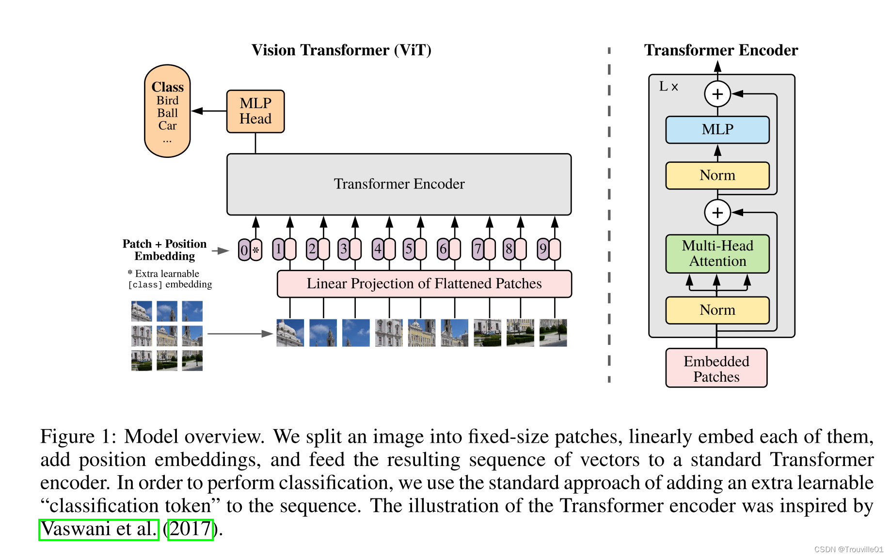

# 论文
+ 论文地址
 [AN IMAGE IS WORTH 16X16 WORDS:TRANSFORMERS FOR IMAGE RECOGNITION AT SCALE](https://arxiv.org/pdf/2010.11929) 

+ 开源地址
  [vision_transformer](https://github.com/google-research/vision_transformer) git

# model

# 代码[1]

# 参考
### ViT
1. [【Sora重要技术】复现ViT（Vision Transformer）模型](https://www.bilibili.com/video/BV1fH4y1H7mV/) V
  [mnist-vit Repo](https://github.com/owenliang/mnist-vit) git

1xx. [VIT (Vision Transformer) 模型论文+代码(源码)从零详细解读，看不懂来打我](https://www.bilibili.com/video/BV1Uu411o7oY) V

1xx. [详解VIT（Vision Transformer)模型原理, 代码级讲解](https://blog.csdn.net/qq_43449643/article/details/135623953)
   [VIT Repo](https://github.com/yangyunfeng-cyber/Useful-DL-Projects-for-Exercise/blob/main/VIT/vit_model.py) git  ***
   
1xx. [ViT｜ Vision Transformer ｜理论 + 代码](https://www.bilibili.com/video/BV1xm4y1b7Pw/)  V
   [PPT](https://65d8gk.axshare.com)

### ViLT
1xx. [ViLT：最简单的多模态Transformer](https://zhuanlan.zhihu.com/p/369733979)
1xx. [ViLT](https://github.com/dandelin/vilt) git
1xx. [ViLT 论文精读【论文精读】](https://blog.csdn.net/qq_42030496/article/details/134641704)
   [ViLT 论文精读【论文精读】](https://www.bilibili.com/video/BV14r4y1j74y/) V
1xx. [多模态ViLT模型下游任务微调原理及代码](https://blog.csdn.net/m0_56722835/article/details/125071550)