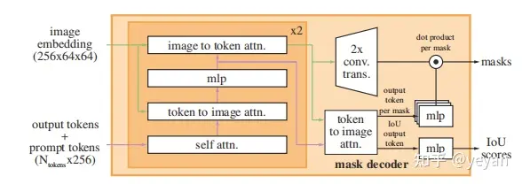

# 论文[1]
+ 论文地址
[Segment Anything Model论文](https://arxiv.org/abs/2304.02643)

+ 开源地址
 [Segment Anything Model模型源码](https://github.com/facebookresearch/segment-anything) Git

+ 官网
 [Segment Anything Model官网](https://segment-anything.com/)  
 [Segment Anything Model官网demo网页端](https://segment-anything.com/demo)    

# 模型[2]
###  image encoder

### prompt encoder

### mask decoder

在prompt embeddings中插入一个可学习的token，用于docoder的输出。
（1）prompt toekns+output tokens进行self attn,
（2）用得到的token和image embedding进行 cross attn（token作为Q）
（3）point-wise MLP 更新token
（4）用image embedding和（3）的token进行cross atten（image embedding作为Q）
重复上述步骤2次，再将attn再通过残差进行连接，最终输出masks和iou scores。

# SAM应用[3]
+ 图像分割
+ 目标检测
+ 图像修复( image inpainting)
+ **模型微调**

# 参考
1. [【模型解读】【代码复现】Segment Anything Model(SAM)](https://blog.csdn.net/weixin_44386956/article/details/130262260) *
2. [【论文解读】MetaAi SAM(Segment Anything) 分割一切](https://zhuanlan.zhihu.com/p/620355474) ***
   最下面有应用
3. [Segment Anything(sam)项目整理汇总](https://zhuanlan.zhihu.com/p/630529550) ***

1xx. [【Segment Anything 模型深度解构】GPT时代，干翻计算机视觉第一步！](https://www.bilibili.com/video/BV1aV4y1d7gC/)
